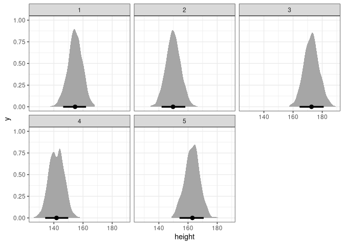

Week 2
================
Alec L. Robitaille
2021-08-24 \[updated: 2021-08-24\]

## Question 1

The weights listed below were recorded in the !Kung census, but heights
were not recorded for these individuals. Provide predicted heights and
89% compatibility intervals for each of these individuals. That is, fill
in the table below, using model-based predictions.

    Individual, weight, expected height, 89% interval
    1, 45,,,
    2, 40,,,
    3, 65,,,
    4, 31,,,
    5, 53,,,

Model:

*h*<sub>*i*</sub> ∼ Normal(*μ*<sub>*i*</sub>,*σ*)

*μ*<sub>*i*</sub> = *α* + *β*(*x*<sub>*i*</sub>−*x̄*)

*α* ∼ Normal(178,20)

*β* ∼ Log-Normal(0,1)

*σ* ∼ Uniform(0,50)

``` r
library(rethinking)
library(data.table)
library(ggplot2)
library(tidybayes)

data(Howell1)

d <- Howell1[Howell1$age >= 18,]

m <- quap(
    alist(
        height ~ dnorm(mu, sigma),
        mu <- a + b * (weight - mean(d$weight)),
        a ~ dnorm(178, 20),
        b ~ dnorm(0, 1),
        sigma ~ dunif(0, 50)
    ), 
    data = d
)

precis(m)
```

    ##              mean         sd        5.5%       94.5%
    ## a     154.6013661 0.27030748 154.1693625 155.0333696
    ## b       0.9034412 0.04189135   0.8364907   0.9703917
    ## sigma   5.0718774 0.19115441   4.7663758   5.3773791

Simulate:

``` r
# Set weights to simulate for
weights <- data.table(weight = c(45, 40, 65, 31, 54),
                                            id = as.character(seq(1, 5)))
simmed <- sim(m, list(weight = weights$weight), n = 1e3)

# Tidy
DT <- melt(as.data.table(simmed), measure.vars = paste0('V', 1:5),
                     value.name = 'height', variable.name = 'id')
DT[, id := gsub('V', '', id)]
# (Not needed with stat eye width)
# DT[, low := PI(height)[1], by = id]
# DT[, high := PI(height)[2], by = id]
DT[weights, weight := weight, on = 'id']

# Plot
ggplot(DT, aes(height)) +
    stat_halfeye(.width = .89) + 
    facet_wrap(~id)
```

<!-- -->
