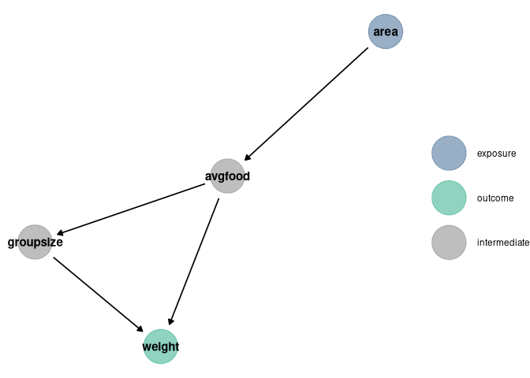
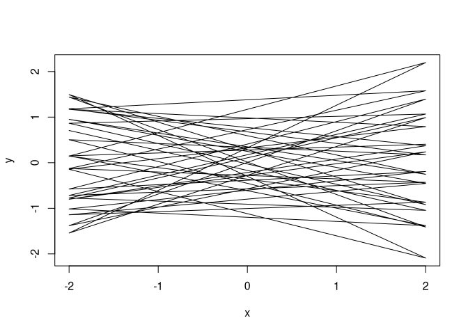
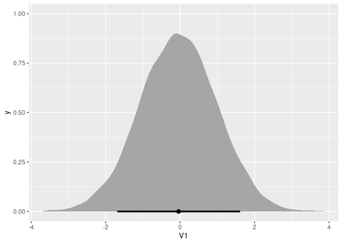
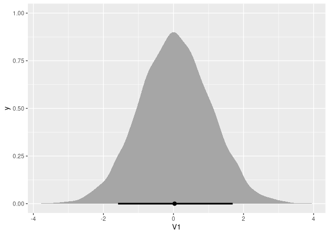
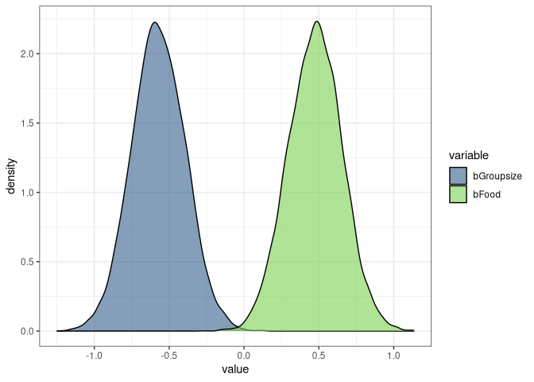

Alec L. Robitaille

# Homework: Week 3

2021-08-25 \[updated: 2021-08-30\]

## Overview

All three problems below are based on the same data. The data in
`data(foxes)` are 116 foxes from 30 different urban groups in England.
These foxes are like street gangs. Group size varies from 2 to 8
individuals. Each group maintains its own (almost exclusive) urban
territory. Some territories are larger than others. The area variable
encodes this information. Some territories also have more avgfood than
others. We want to model the weight of each fox. For the problems below,
assume this DAG

### Setup

``` r
# Packages
library(ggdag)
```

    ## 
    ## Attaching package: 'ggdag'

    ## The following object is masked from 'package:stats':
    ## 
    ##     filter

``` r
library(dagitty)
library(data.table)
library(ggplot2)
library(tidybayes)

# DAG
dag_plot <- function(dag) {
    stat <- node_status(dag, FALSE)
    stat$data$status[is.na(stat$data$status)] <- 'intermediate'
    ggplot(stat, aes(x = x, y = y, xend = xend, yend = yend)) +
      geom_dag_point(aes(color = status), alpha = 0.5, size = 15) +
      geom_dag_edges() +
        labs(color = '') + 
      geom_dag_text(color = 'black') +
        scale_color_manual(values = list('exposure' = '#35608DFF',
                                                                         'outcome' = '#22A884FF',
                                                                         'intermediate' = 'grey50')) + 
      theme_void()
}

dag <- dagify(
    weight ~ groupsize + avgfood,
    groupsize ~ avgfood,
    avgfood ~ area,
    exposure = 'area',
    outcome = 'weight'
)

dag_plot(dag)
```

<!-- -->

## Question 1

> Use a model to infer the total causal influence of area on weight.
> Would increasing the area available to each fox make it heavier
> (healthier)? You might want to standardize the variables. Regardless,
> use prior predictive simulation to show that your model’s prior
> predictions stay within the possible outcome range.

### Workings

Area on weight

scale(weight) \~ dnorm(mu, sigma)  
mu &lt;- a + b \* (scale(area))  
a: intercept  
when weight and area are scaled, the expected intercept is 0  
therefore  
a \~ dnorm(0, 0.5)

b: beta, rate of change given one unit of increase in area  
b \~ dnorm(0, 1)

sigma: standard deviation  
uniform prior  
sigma \~ dunif(0, 50)

### Model

``` r
library(rethinking)

data(foxes)

foxes$scale_area <- scale(foxes$area)
foxes$scale_weight <- scale(foxes$weight)

m1 <- quap(
    alist(
        scale_weight ~ dnorm(mu, sigma),
        mu <- a + bArea * scale_area,
        a ~ dnorm(0, 0.05),
        bArea ~ dnorm(0, 0.5),
        sigma ~ dunif(0, 50)
    ), 
    data = foxes
)
```

### Prior predictive simulation

``` r
plot_link <- function(DT, n) {
    data.table(DT)[sample(.N, n), 
                                 plot(data.table(x = rep(c(-2, 2), .N), 
                                                                 y = c(V1, V2)),
                                         type = 'l')]
}

prior <- extract.prior(m1)
l <- link(m1, post = prior, data = list(scale_area = c(-2, 2)))
plot_link(l, 20)
```

<!-- -->

    ## NULL

### Paths

Interest: Area on Weight

Paths

1.  Area -&gt; Avgfood -&gt; Weight
2.  Area -&gt; Avgfood -&gt; Groupsize -&gt; Weight

Avgfood and Groupsize are pipes between Area and Weight. There are no
backdoors or colliders.

### Interpretation

> Would increasing the area available to each fox make it heavier
> (healthier)?

`bArea` has a mean of 0.02, with compatibility intervals around 0.
Therefore the model does not indicate a total causal influence of area
on the weight.

``` r
precis(m1)
```

    ##           mean    sd  5.5% 94.5%
    ## a     0.000031 0.044 -0.07  0.07
    ## bArea 0.018799 0.091 -0.13  0.16
    ## sigma 0.995555 0.065  0.89  1.10

``` r
post <- extract.samples(m1)
s <- sim(m1, data = list(scale_area = c(-2, 2)), post = post)

ggplot(data.table(s), aes(V1)) +
    stat_halfeye(.width = .89)
```

<!-- -->

## Question 2

> Now infer the causal impact of adding food to a territory. Would this
> make foxes heavier? Which covariates do you need to adjust for to
> estimate the total causal influence of food?

### Paths

Interest: Food on weight

Paths:

1.  Food -&gt; Weight
2.  Food -&gt; Groupsize -&gt; Weight

Groupsize is a pipe between Area and Weight. There are no backdoors or
colliders.

### Model

``` r
foxes$scale_avgfood <- scale(foxes$avgfood)

m2 <- quap(
    alist(
        scale_weight ~ dnorm(mu, sigma),
        mu <- a + bFood * scale_avgfood,
        a ~ dnorm(0, 0.05),
        bFood ~ dnorm(0, 0.5),
        sigma ~ dunif(0, 50)
    ), 
    data = foxes
)

precis(m2)
```

    ##            mean    sd  5.5% 94.5%
    ## a     -0.000031 0.044 -0.07  0.07
    ## bFood -0.024198 0.091 -0.17  0.12
    ## sigma  0.995399 0.065  0.89  1.10

``` r
post <- extract.samples(m2)
s <- sim(m2, data = list(scale_avgfood = c(-2, 2)), post = post)

ggplot(data.table(s), aes(V1)) +
    stat_halfeye(.width = .89)
```

<!-- -->

### Interpretation

> Would this make foxes heavier? Which covariates do you need to adjust
> for to estimate the total causal influence of food?

`bFood` has a mean of -0.02, with compatibility intervals around 0. The
model does not indicate a total causal influence of area on the weight.
No covariates are needed to estiamte the total causal influence of food
because there are no backdoors or colliders.

## Question 3

> Now infer the causal impact of group size. Which covariates do you
> need to adjust for? Looking at the posterior distribution of the
> resulting model, what do you think explains these data? That is, can
> you explain the estimates for all three problems? How do they go
> together?

### Paths

Interest: Group size on weight

Paths:

1.  Groupsize -&gt; Weight
2.  Groupsize &lt;- Avgfood -&gt; Weight

Avgfood is a collider between Groupsize and Weight. There is a backdoor
on Groupsize and the path is closed.

``` r
foxes$scale_groupsize <- scale(foxes$groupsize)

m3 <- quap(
    alist(
        scale_weight ~ dnorm(mu, sigma),
        mu <- a + bGroupsize * scale_groupsize + bFood * scale_avgfood,
        a ~ dnorm(0, 0.05),
        bGroupsize ~ dnorm(0, 0.5),
        bFood ~ dnorm(0, 0.5),
        sigma ~ dunif(0, 50)
    ), 
    data = foxes
)

precis(m3)
```

    ##                  mean    sd   5.5%  94.5%
    ## a          -0.0000082 0.043 -0.069  0.069
    ## bGroupsize -0.5724746 0.180 -0.860 -0.285
    ## bFood       0.4762252 0.180  0.189  0.763
    ## sigma       0.9458928 0.062  0.846  1.046

``` r
DT <- melt(data.table(extract.samples(m3))[, .(bGroupsize, bFood)])
```

    ## Warning in melt.data.table(data.table(extract.samples(m3))[, .(bGroupsize, :
    ## id.vars and measure.vars are internally guessed when both are 'NULL'. All
    ## non-numeric/integer/logical type columns are considered id.vars, which in this
    ## case are columns []. Consider providing at least one of 'id' or 'measure' vars
    ## in future.

``` r
ggplot(DT) + 
    geom_density(aes(value, fill = variable), alpha = 0.6) + 
    theme_bw() + scale_fill_viridis_d(begin = 0.3, end = 0.8)
```

<!-- -->

### Interpretation

> Which covariates do you need to adjust for? Looking at the posterior
> distribution of the resulting model, what do you think explains these
> data? That is, can you explain the estimates for all three problems?
> How do they go together?

The Avgfood covariate needs to be included since it is a collider
between Groupsize and Weight. The mean and compatibility intervals of
bFood are positive, while the mean and compatibility intervals of
bGroupsize are negative. This indicates food’s positive relationship
with weight could be buffered or interacting with the negative
relationship of group size. Increased food leads to increased body
weight, but more food also results in larger groups, which decreases the
food availability.
