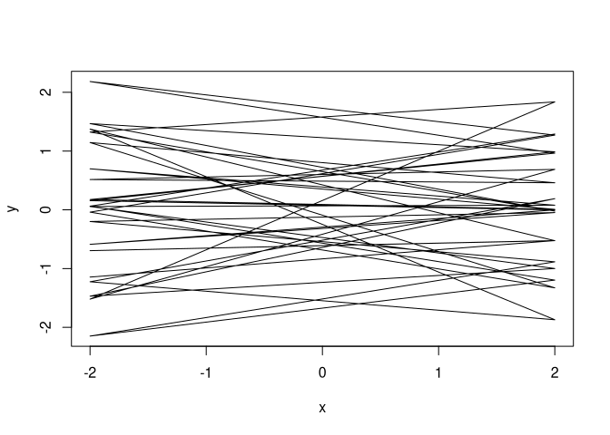

Week 3
================
Alec L. Robitaille
2021-08-25 \[updated: 2021-08-25\]

# Overview

All three problems below are based on the same data. The data in
`data(foxes)` are 116 foxes from 30 different urban groups in England.
These foxes are like street gangs. Group size varies from 2 to 8
individuals. Each group maintains its own (almost exclusive) urban
territory. Some territories are larger than others. The area variable
encodes this information. Some territories also have more avgfood than
others. We want to model the weight of each fox. For the problems below,
assume this DAG

## Setup DAG

``` r
library(ggdag)
```

    ## 
    ## Attaching package: 'ggdag'

    ## The following object is masked from 'package:stats':
    ## 
    ##     filter

``` r
library(dagitty)
library(data.table)
library(ggplot2)

dag_plot <- function(dag) {
    stat <- node_status(dag, FALSE)
    stat$data$status[is.na(stat$data$status)] <- 'intermediate'
    ggplot(stat, aes(x = x, y = y, xend = xend, yend = yend)) +
      geom_dag_point(aes(color = status), alpha = 0.5, size = 15) +
      geom_dag_edges() +
        labs(color = '') + 
      geom_dag_text(color = 'black') +
        scale_color_manual(values = list('exposure' = '#35608DFF',
                                                                         'outcome' = '#22A884FF',
                                                                         'intermediate' = 'grey50')) + 
      theme_void()
}

dag <- dagify(
    weight ~ groupsize + avgfood,
    groupsize ~ avgfood,
    avgfood ~ area,
    exposure = 'area',
    outcome = 'weight'
)

dag_plot(dag)
```

<!-- -->

# Question 1

Use a model to infer the total causal influence of area on weight. Would
increasing the area available to each fox make it heavier (healthier)?
You might want to standardize the variables. Regardless, use prior
predictive simulation to show that your model’s prior predictions stay
within the possible outcome range.

## Workings

AREA ON WEIGHT

scale(weight) \~ dnorm(mu, sigma)  
mu &lt;- a + b \* (scale(area))  
a: intercept  
when weight and area are scaled, the expected intercept is 0  
therefore  
a \~ dnorm(0, 0.5)

b: beta, rate of change given one unit of increase in area  
b \~ dnorm(0, 1)

sigma: standard deviation  
uniform prior  
sigma \~ dunif(0, 50)

## Model

``` r
library(rethinking)

data(foxes)

foxes$scale_area <- scale(foxes$area)
foxes$scale_weight <- scale(foxes$weight)

m1 <- quap(
    alist(
        scale_weight ~ dnorm(mu, sigma),
        mu <- a + bArea * scale_area,
        a ~ dnorm(0, 0.05),
        bArea ~ dnorm(0, 0.5),
        sigma ~ dunif(0, 50)
    ), 
    data = foxes
)
```

## Prior predictive simulation

``` r
plot_link <- function(DT, n) {
    data.table(DT)[sample(.N, n), 
                                 plot(data.table(x = rep(c(-2, 2), .N), 
                                                                 y = c(V1, V2)),
                                         type = 'l')]
}

prior <- extract.prior(m1)
l <- link(m1, post = prior, data = list(scale_area = c(-2, 2)))
plot_link(l, 20)
```

<!-- -->

    ## NULL

## Paths

Interest: Area on Weight

Paths

1.  Area -&gt; Avgfood -&gt; Weight
2.  Area -&gt; Avgfood -&gt; Groupsize -&gt; Weight

There are pipes between Avgfood and between Avgfood and Groupsize.

## Interpretation

> Would increasing the area available to each fox make it heavier
> (healthier)?

`bArea` has a mean of 0.02, with compatibility intervals around 0.
Therefore the model does not indicate an influence of area on the
weight.

``` r
precis(m1)
```

    ##             mean    sd  5.5% 94.5%
    ## a     0.00000013 0.044 -0.07  0.07
    ## bArea 0.01882826 0.091 -0.13  0.16
    ## sigma 0.99549245 0.065  0.89  1.10

``` r
post <- extract.samples(m1)
s <- sim(m1, data = list(scale_area = c(-2, 2)), post = post)

library(tidybayes)
ggplot(data.table(s), aes(V1)) +
    stat_halfeye(.width = .89)
```

<!-- -->

``` r
# TODO: come back to this
```

# Question 2

Now infer the causal impact of adding food to a territory. Would this
make foxes heavier? Which covariates do you need to adjust for to
estimate the total causal influence of food?

Food on weight

Paths: Food -&gt; Weight, Food -&gt; Groupsize -&gt; Weight

Since Groupsize is a pipe between Food and Weight, it needs to be
adjusted for to estimate the total causal influence of food.

## Model

``` r
foxes$scale_avgfood <- scale(foxes$avgfood)
foxes$scale_groupsize <- scale(foxes$groupsize)

m2 <- quap(
    alist(
        scale_weight ~ dnorm(mu, sigma),
        mu <- a + bGroupsize * scale_groupsize + bAvgfood * scale_avgfood,
        a ~ dnorm(0, 0.05),
        bGroupsize ~ dnorm(0, 0.5),
        bAvgfood ~ dnorm(0, 0.5),
        sigma ~ dunif(0, 50)
    ), 
    data = foxes
)

m2_withoutGroupsize <- quap(
    alist(
        scale_weight ~ dnorm(mu, sigma),
        mu <- a + bAvgfood * scale_avgfood,
        a ~ dnorm(0, 0.05),
        bAvgfood ~ dnorm(0, 0.5),
        sigma ~ dunif(0, 50)
    ), 
    data = foxes
)

prior <- extract.prior(m2)
precis(prior)
```

    ##                mean     sd   5.5%  94.5%  histogram
    ## a          -0.00034  0.049 -0.081  0.076     ▁▂▇▇▂▁
    ## bGroupsize  0.02572  0.495 -0.787  0.834    ▁▂▇▇▃▁▁
    ## bAvgfood   -0.01768  0.493 -0.818  0.756   ▁▁▂▇▇▂▁▁
    ## sigma      25.14531 14.697  2.746 47.440 ▇▇▇▅▇▅▇▇▇▇

## Interpretation

``` r
precis(m2)
```

    ##                  mean    sd   5.5%  94.5%
    ## a          -0.0000032 0.043 -0.069  0.069
    ## bGroupsize -0.5727490 0.180 -0.860 -0.286
    ## bAvgfood    0.4764850 0.180  0.189  0.764
    ## sigma       0.9458692 0.062  0.846  1.046

When adjusting for the group size, avgfood has a positive relationship
with weight and group size has a negative relationship with weight. If
group size is excluded from the model (as shown below), avgfood does not
show a relationship to weight.

``` r
precis(m2_withoutGroupsize)
```

    ##                 mean    sd  5.5% 94.5%
    ## a         0.00000017 0.044 -0.07  0.07
    ## bAvgfood -0.02420457 0.091 -0.17  0.12
    ## sigma     0.99536883 0.065  0.89  1.10

# Question 3

Now infer the causal impact of group size. Which covariates do you need
to adjust for? Looking at the posterior distribution of the resulting
model, what do you think explains these data? That is, can you explain
the estimates for all three problems? How do they go together?

Group size on weight

Paths:

Groupsize -&gt; Weight, Groupsize &lt;- Avgfood -&gt; Weight

Avgfood is a fork between groupsize and weight.

``` r
m2 <- quap(
    alist(
        scale_weight ~ dnorm(mu, sigma),
        mu <- a + bGroupsize * scale_groupsize + bAvgfood * scale_avgfood,
        a ~ dnorm(0, 0.05),
        bGroupsize ~ dnorm(0, 0.5),
        bAvgfood ~ dnorm(0, 0.5),
        sigma ~ dunif(0, 50)
    ), 
    data = foxes
)

m2_withoutGroupsize <- quap(
    alist(
        scale_weight ~ dnorm(mu, sigma),
        mu <- a + bAvgfood * scale_avgfood,
        a ~ dnorm(0, 0.05),
        bAvgfood ~ dnorm(0, 0.5),
        sigma ~ dunif(0, 50)
    ), 
    data = foxes
)

prior <- extract.prior(m2)
precis(prior)
```

    ##                mean     sd   5.5%  94.5%  histogram
    ## a          -0.00094  0.049 -0.081  0.079     ▁▂▇▇▃▁
    ## bGroupsize -0.00434  0.496 -0.778  0.784    ▁▁▂▇▇▂▁
    ## bAvgfood    0.01009  0.520 -0.803  0.834   ▁▁▃▇▇▃▁▁
    ## sigma      25.65023 14.338  2.912 47.021 ▅▇▅▇▅▇▇▇▇▇
