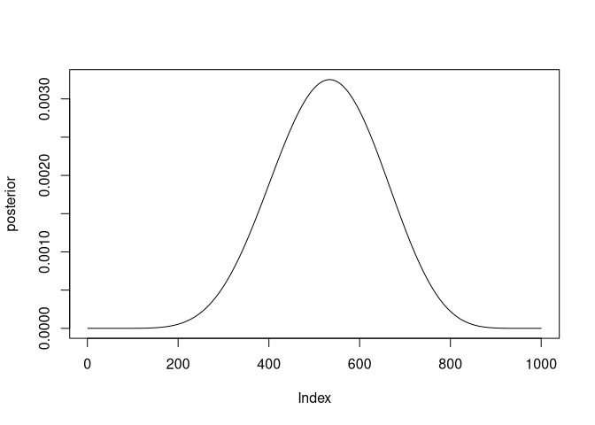

Week 1
================
Alec L. Robitaille
2021-08-18

## Variables

N: fixed by experimenter

p: Prior probability

W: A probability distribution given the data.

## Joint model

W \~ Binomial(N , p)

p \~ Uniform(0, 1)

W is distributed binomially with N observations and probability p on
each

p is distributed uniformally at 1

## Question 1

Suppose the globe tossing data (Chapter 2) had turned out to be 4 water
in 15 tosses. Construct the posterior distribution, using grid
approximation. Use the same flat prior as in the book.

``` r
# Size of grid for grid approximation
gridsize <- 1000

# Prior grid
prior_grid <- seq(0, 1, length.out = gridsize)

# Prior probability (all 1)
prior_prob <- rep(1, gridsize)

# Data probability
#  given 4/15, using binomial distribution
data_prob <- dbinom(4, 15, prob = prior_grid)

# Calculate the posterior numerator by multiplying prior and data probability
posterior_num <- prior_prob * data_prob
# Standardize by sum of posterior numerator
posterior <- posterior_num / sum(posterior_num)

# Save for later
posterior_1 <- posterior

plot(posterior, type = 'l')
```

<!-- -->

## Question 2

Start over in 1, but now use a prior that is zero below p = 0.5 and a
constant above p = 0.5. This corresponds to prior information that a
majority of the Earth’s surface is water. What difference does the
better prior make?

``` r
# Size of grid for grid approximation
gridsize <- 1000

# Prior grid
prior_grid <- seq(0, 1, length.out = gridsize)

# Prior probability (all 1 above 0.5, all 0 below)
prior_prob <- c(rep(0, gridsize / 2), rep(1, gridsize / 2))

# Data probability
#  given 4/15, using binomial distribution
data_prob <- dbinom(4, 15, prob = prior_grid)

# Calculate the posterior numerator by multiplying prior and data probability
posterior_num <- prior_prob * data_prob
# Standardize by sum of posterior numerator
posterior <- posterior_num / sum(posterior_num)

# Save for later
posterior_2 <- posterior

plot(posterior, type = 'l')
```

<!-- -->

Narrower curve, higher max, all zeroes before 0.5

## Question 3

For the posterior distribution from 2, compute 89% percentile and HPDI
intervals. Compare the widths of these intervals. Which is wider? Why?
If you had only the information in the interval, what might you
misunderstand about the shape of the posterior distribution?

``` r
library(rethinking)
```

    ## Loading required package: rstan

    ## Loading required package: StanHeaders

    ## Loading required package: ggplot2

    ## rstan (Version 2.21.2, GitRev: 2e1f913d3ca3)

    ## For execution on a local, multicore CPU with excess RAM we recommend calling
    ## options(mc.cores = parallel::detectCores()).
    ## To avoid recompilation of unchanged Stan programs, we recommend calling
    ## rstan_options(auto_write = TRUE)

    ## Loading required package: parallel

    ## rethinking (Version 2.13)

    ## 
    ## Attaching package: 'rethinking'

    ## The following object is masked from 'package:stats':
    ## 
    ##     rstudent

``` r
library(ggplot2)
library(data.table)

# Calculate Percentile Interval at 89%
percent_interval <- PI(posterior, prob = 0.89)

# Calculate Highest Posterior Density at 89%
highest_post_dens <- HPDI(posterior, prob = 0.89)
```
