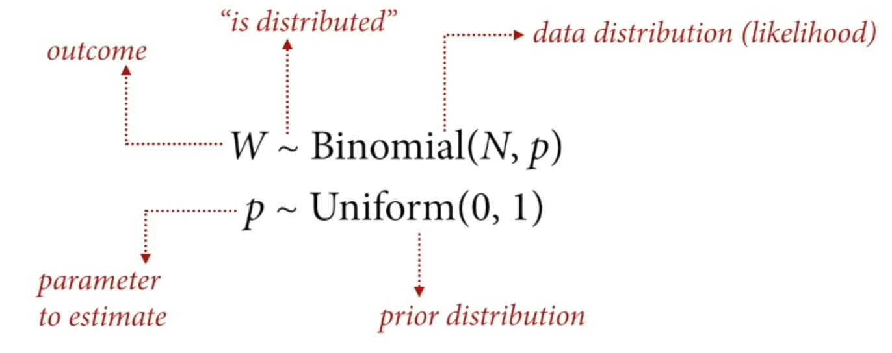
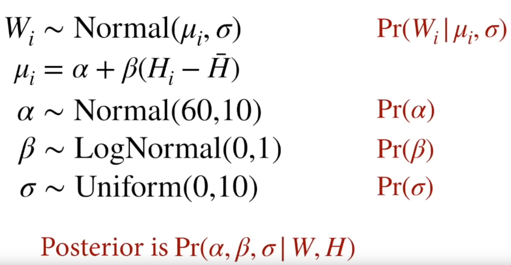
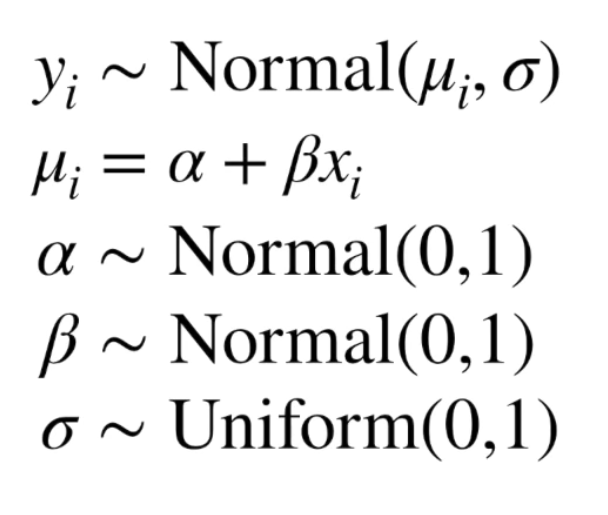
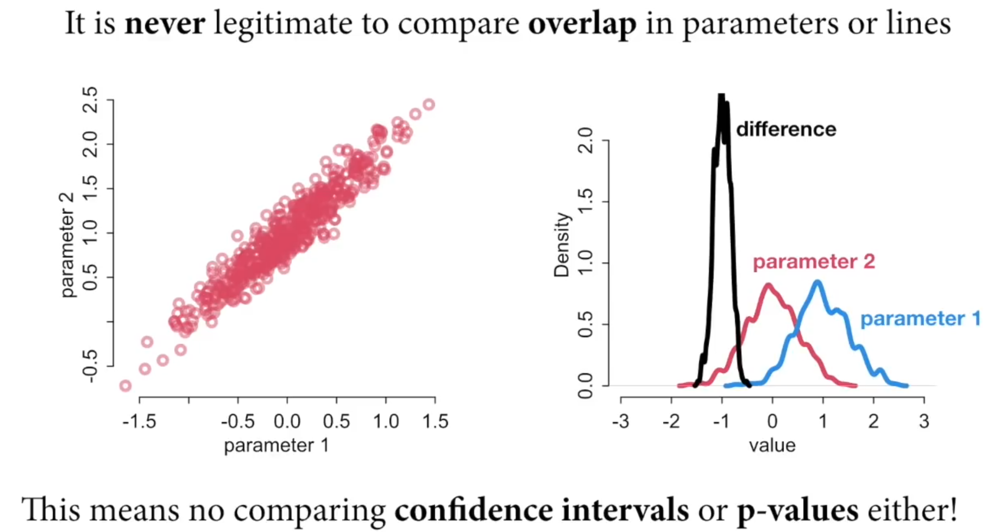

# (PART) Lectures 2022 {-}

# Lecture 01 - 2022

## Golems

* powerful
* no intent
* require careful instructinos

## Hypotheses - Process models - Statistical models

Hypotheses are vague. To work with them, we need to transform into process models

Process models are precise and causal. However, different process models can yield different or the same statistical model. 

Statistical models strictly examine associations, not causation. 

## Null models

Unique, singular null models are not always feasible, eg. communities, networks and phylogenies.

## Drawing the Bayesian owl

1. Theoretical estimand (precisely defined in:)
2. Scientific causal models
3. Combine theoretical estimate and scientific causal models to build statistical models
4. Simulate scientific causal models to validate statistical models yield theoretical estimand
5. Analyse real data

## Why Bayesian?

* flexible
* express uncertainty at all levels
* direct solutions to measurement error and missing data
* focus on scientific models instead of navigating flowcharts of different models and test - use the same approach for different problems

## DAGs
Scientific insights = scientific causal models + statistical models

Causes are not found in the data, the data just has associations between variables

Even when the goal is descriptive, you need causal thinking to define how a sample differs from the population

Causal inference is the prediction of intervention
* predict the consequences of an intervention
* "What if I do this?"

Causal imputation is 
* being able to construct unobserved counterfactual outcomes
* "What if I had done something else?"

DAGs are heuristic causal models and help with
* deciding which variables to include
* determining how to test a causal model
* identifying bad controls

# Lecture 02 - 2022

## Bayesian data analysis

**For each possible explanation of the data, count all the ways the data can happen. Explanations with more ways to produce the data are more plausible.**

## Misc

Area under the curve = 1 because it is normalized 

1. No minimum sample size
2. Shape embodies samplen size
3. No point estimates since the distribution is the estimate (always use the entire distribution)
4. No one true interval

## Using a posterior

A model's behaviour is a function of all of its parameters at the same time, therefore you can't just gaze at tables of parameters

* posterior predictive simulation
* model based forecasts
* causal effects
* counterfactuals
* prior predictions

# Lecture 03 - 2022
# Statistical Rethinking 2022 - Lecture 03

## Geocentric models

The geocentric model describes where the Earth is at the center, and Mars orbits around 
Earth's orbit. 

This is an example of prediction without explanation because it's an 
accurate approximation without understanding the true state or mechanism. 

The statistics analog, is a linear regression since it can be descriptively
accurate but mechanistically wrong. 

## Linear regression

Model of mean and variance of some variable

The mean as a weighted sum of other variables

## Normal distribution

The normal distribution is observed where there is a sum of fluctuations. 
There is a symmetric variation around the mean. The normal distribution 
is a maxent distribution. 

Note: a variable does not have to be distributed normally for the 
normal distribution to be appropriate. 

## Language for modeling

To compute these, we arrange them as probability statements. The pipe "|" means 
"is conditional on". 

## Scientific workflow

1. Question/goal/estimand
2. Scientific model
3. Statistical model
4. Validate the model
5. Analyze the data

### Example: adult height and weight

Describe the association between, for example, adult height and weight.
How does height influence weight?

If height influences weight

H -> W

then we can restructure this as a function

W = f(H)

The arrow from H to W indicates the consequences of an intervention. If you change 
the height of an individual (at birth), their weight will change, but the 
reverse is not true. 

The equation for a line

$y_{i} = a + \beta x_{i}$

is used in a linear regression to give a line with an expected value of y
for each value of x, an expectation. 

Sigma is a scale parameter, these types of parameters stretch a distribution
and are always positive. 

Variables can have part of their priors "built in", eg. when they have clear boundaries, like must be a positive number

Rescaling variables can help to pick priors because they are centered with a mean of 0

The joint posterior simultaneously considers all variables

## Validating models

Validating models: 

* simulation-based validation, taking the scientific model and simulating data from
it. Then, test the statistical model and see if it returns approximately 
the same values back
* even better, simulation-based calibration (TO READ)

## Statistical interpretation

* Parameters are not independent of one another
* Need to consider all variables using the posterior to interpret the results

For example,

1. Plot sample data
1. Plot the posterior mean
1. Plot uncertainty around the mean
1. Plot uncertainty around the predictions

## Misc

Log normal distributions are positive constrained and can be described as:
* normal distribution exponentiated
* (or) distribution that would be normal if you took the log

# Lecture 04 - 2022

## Categories

Discrete, unordered types

Options: 

1. Indicator variables (0, 1, 1, 0, ...)
2. Index variables (1, 2, 3, 4, 5, ...)

Index variables are preferred and more easily extent to multilevel models. 

## Priors

Specifying priors for categorical variables: usually assign the same prior
for each type in the category since this is the most neutral approach. 

## Computing contrasts

We can't compare overlap in parameters  (eg. a precis output) directly, 
we need to compute the distribution of differences. 

Given the posterior, compute the difference in the posterior predicted variable
between groups and plot the histogram. 

Alternatively, you can simulate from the posterior distribution and plot the
contrast directly. 

## Full Luxury Bayesian

Include the full causal model in one statistical model

See other note where this is expanded on

## Curves

Types of linear models fit with curves: 

* polynomials
* splines and GAMs 

Splines and GAMs are generally preferred. 

### Polynomials 

Include a higher order polynomial term to add a curvature to the linear model. 
These models are geocentric and symmetrical, which generally doesn't match
scientific background or theory. They are also very error prone outside 
of the scope of the data. 

Note: It is always an improvement of fit to include another polynomial term. 

### Splines

Splines are built from functions that are locally smooth. These are not a 
mechanistic model. 

B splines / basis splines are linear regressions with synthetic variables. 

Ideally, use scientific information to build a mechanistic model instead. 
More about this later in the course. 

<!-- ------------------------------------------------------------------- -->
# (PART) References {-}
# References

<!-- ------------------------------------------------------------------- -->
