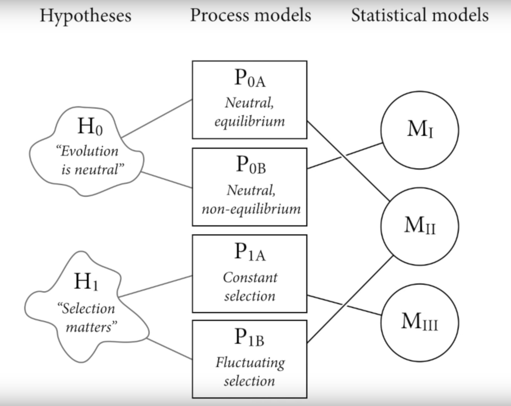
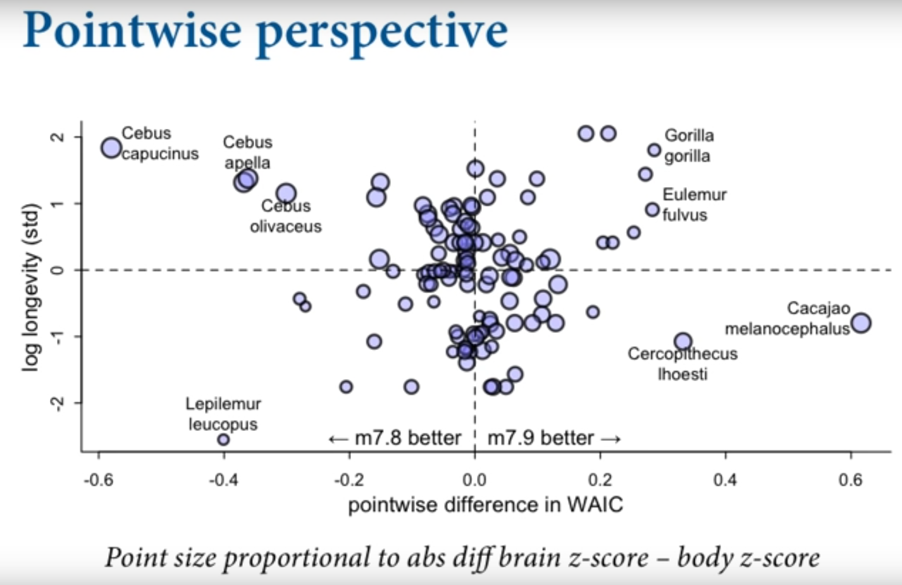
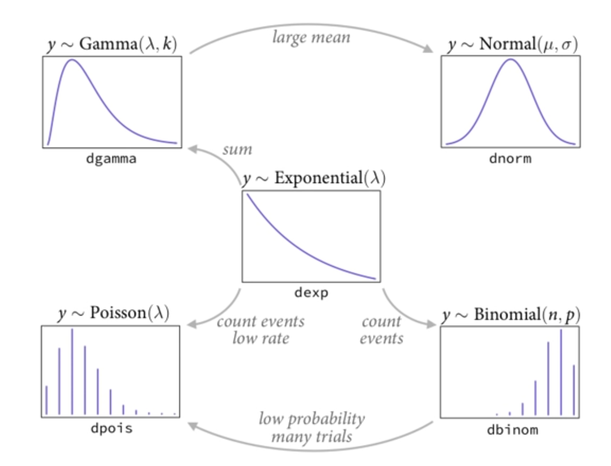

# (PART) Lectures 2019 {-}

# Lecture 01 - 2019

### Popper

- generate meaningful (not null) hypotheses and predictions and falsify those

### Approach

A framework for developing + using statistical golems

1. Bayesian data analysis
    - uses probability to describe uncertainty
    - "count all the ways data can happen, according to assumptions and the assumptions with more ways consistent with the data are more plausible"
2. Multilevel models
    - Models within models
    - Avoids averaging
    - ...
3. Model comparison
    - Compare meaningful (not null) models
    - Caution: over fitting

## Hypotheses - Process Models - Statistical Models

Any statistical model M can correspond to multiple process models

Any hypothesis H may correspond to multiple process models

Any statistical model may correspond to multiple hypothesis



## Small world / large world

Small world: models have assumptions, Bayesian models fit optimally

Large world: real world, no guarantee of optimality

## Example: four marbles

**Setup**

4 marbles, either black or white, with replacement

Possibilities (5) therefore: WWWW, BWWW, BBWW, BBBW, BBBB

Observation: BWB

**Calculate**

Given 3 observations, there are 4 choices, for a total of 64 possibilities

Given we observed both a white and a black marble, possibilities WWWW and BBBB are not valid

At each branch, there are 3 possibilities it can be white and 1 possibility it can be black

Bayesian is additive, at each branch just sum the possibility

BWWW: 3 = 1 * 3 * 1

BBWW: 8 = 2 * 2 * 2

BBBW: 9 = 3 * 1 * 3

**Using new information**

New information is directly integrated into the old information, therefore just multiply it through

So if we take another measure of B, multiply the property through

BWWW: 3 * 1 = 3

BBWW: 8 * 2 = 16

BBBW: 9 * 3 = 27

**Using other information**

Factory says B measures are rare, but minimum of 1 per bag

               Factory info

WWWW 0 since we observed a B

BWWW: 3

BBWW: 2

BBBW: 1

BBBB 0 since we observed a W

Multiply it through

BWWW: 3 * 3 = 9

BBWW: 16 * 2 = 32

BBBW: 1 * 27 = 27

*Counts get huge - therefore we **normalize them giving us probabilities (0-1)***

Probability theory is just normalized counting

## Building a model

1. Design the model 
2. Condition on the data
3. Evaluate, critique the model
4. (Restart)

# Lecture 02 - 2019

## Joint prior distribution

The joint prior distribution is the prior probability of distribution + parameters

## Example: inflatable world

### **Design the model**

p: water proportion

1-p: land proportion

### **Condition**

Bayes updating: converts priors to posteriors

- Adds all data at once
- All posteriors are the prior for next observation
- Sample size is embodied in the posterior

### **Evaluate**

Golem must be supervised

- Did it malfunction?
- Does the answer make sense?
- ...

### Define parameters

N: fixed by experimenter

W: a probability distribution, in this case a binomial distribution

WLWWLWWLW

`dbinom(6, size = 9, prob = 0.5)`

p: prior probability distribution, in this case uniformed

### Joint model

W ~ Binomial(N, p)

p ~ Uniform(0, 1)

(W is distributed binomially with probability p on each measure, p is uniform at 1)

### Posterior

Posterior = (probability observed variables * prior)  / normalizing constant

(If priors are uniform, they don't affect the shape of the posterior. They may influence the shape though)

## Grid approximation

Grid approximation: consider only a finite discrete set of solutions

For example, 1000 solutions

1. Generate a sequence of solutions  `seq_sol <- seq(0, 1, length.out = 1000)`
2. Prior = uniform 1 across sequence of solutions `prior <- rep(1, seq_sol)`
3. Probability of data = binomial `prob_data <- dbinom(6, size = 9, prob = seq_sol)`
4. Posterior numerator = `posterior_num <- prior * prob_data`
5. Posterior standardized = `posterior_numerator / sum(posterior_num)`

### Sampling from the posterior

Approximate the posterior, then you can sample from the posteriors `sample(p, prob = posterior, 1e4, replace = TRUE)`

**Summarize**

- above/below some value
- Percentile interval
- Highest posterior density interval
- ...

**Predictive checks**

- `rbinorm(1e4, size = 0, prob = samples)`
- ...

# Lecture 03 - 2019

## Regressions

- Model of mean and variance of some normally distributed measure
- Mean as additive combination of weighted variables
- Typical assumed constant variable (???)
- The line returned is the mean - but with Bayesian we want to see the distribution of lines, ranked by plausibility
- The model endorses the line, but the line doesn't necessarily fit the data
- In regressions there will always be more certainty at the means and bow tie towards the limits of the data
- Regression models don't have arrows like DAGs - they just measure associations.

## Normal distributions

Normal distributions arise when repeated fluctuations tend to cancel near 0

The Gaussian distribution is the most conservative distribution to use for a prior, it is the best option if no additional scientific information is available

## Prior predictive distributions

Simulate from the joint posterior distribution and evaluate

1. Setup model with `quap`
2. `prior <- extract.prior(model)`
3. `link(model, post = prior, data = seq)` 
    - where the seq is a sequence of your x variable (eg for standardize -2, 2
4. Plot lines

These are all the possibility given the prior, **not the data**

If the lines show such a limited relationship that you'd expect that the true relationship is outside of these, expand the priors. 

If alternatively they are widely implausible, tighten the priors. 

## Quadratic approximate

In a multidimensional space, QUAP uses gradient climbing to find peaks

Maximum likelihood estimation = QUAP with flat priors

Function in rethinking is `rethinking::quap`

## Centering variables

`x - mean(x)`

Should be default behavior when doing a regression

# Lecture 04 - 2019

## Standardizing variables

`(x - mean(x)) / sd(x)` or `scale(x)`

Result = mean of 0, sd of 1

Helps software fit

Value = 1 is equal to 1 SD

## Plotting uncertainty - sample from posterior

(if multivariate normal)

1. Approximate posterior from mean, standard deviation
2. Sample from multivariate normal distribution of parameters
3. Use samples to generate predictions that integrate over uncertainty

`extract_samples` returns a, b, sigma, ... and you can plot each

## Polynomials

Polynomials have bad behavior especially at the boundaries of the data

They don't fit locally, and are not actually flexibly. 

Eg. a polynomial of 3rd degree will necessarily have two turns - this has to happen irrespective of the data

## Splines

Locally wiggly functions, combined by interpolation

Geocentric - describing relationships - not exploring them

## Basis splines

Bayesian B-splines = P-splines

Similar to linear models but with synthetic variables

$\mu = \alpha + w_{1} \beta_{1} + + w_{2} \beta_{2} + + w_{3} \beta_{3} + + w_{4} \beta_{4} + ...$

Knots are often picked at equal intervals in data, though strategies vary

At each knot, the knot's function is at 100%, moving away from it, the neighboring functions *turn on*

Parameters always have more uncertainty than predictions

Caution: over fitting

### Recipe

1. Choose knots - points where spline pivots
2. Choose degree of basis functions - how wiggly, polynomial
3. Find posterior distribution of weights

# Lecture 05 - 2019

## Multiple regression models

Why?

- Spurious associations
- Determining the value of some predictor given other predictors
    - eg. divorce rate given marriage rate and median age at marriage. Once we know marriage rate, what is the value in knowing median age?

## Directed acyclic graphs (DAG)

Directed: arrows, indicating causal implications

Acyclic: no loops

**Unlike statistical models, DAGs have causal implications**

eg. Median age → marriage rate → divorce rate, Median age → divorce rate

## Example: Age, marriage, divorce

$D_{i} \sim \text{Normal}(\mu_{i}, \sigma)$

$\mu_{i} = \alpha + \beta_{M}M_{i} + \beta_{A}A_{i}$

(M)arriage rate

(A)ge at marriage

(D)ivorce rate

### Priors

Standardize to z-scores 

$\alpha$ = expected value for response when all values are 0. since they are all standardized the response should be 0. Without peaking at the data, this could be hard to guess. But after standardization, it is much simpler. 

Slopes - use prior predictive simulation. Harder. 

### Prior predictive simulation

See [Prior predictive distributions](https://www.statistical-rethinking.robitalec.ca/lecture-03.html#prior-predictive-distributions)

### Interpretation

Once we know median age at marriage, there is little additional value in knowing marriage rate. 

Once we know marriage rate, there is still value in knowing median age at marriage. 

If we don't know median, it is still useful to know marriage rate, since median age at marriage is related to marriage rate. However, we don't want to try and influence eg. policy on marriage rate, since it isn't causal on divorce rate.

## Plotting multivariate posteriors

1. Regress predictor on other predictors
2. Compute predictor residuals
3. Regress outcome on residuals

**Side note: never analyze the residuals.** 

### Posterior predictive checks

Compute implied predictions for observed cases

Again, regressions will always do well in the area around the mean

## Reveal masked associations

Sometimes association between outcome and predictor is masked by another variable

This tends to arise when 2 predictors associated with the outcome have opposite effects on it

## Categorical variables

Two approaches: 

1. Use dummy/indicator variables
2. Use index variables

**Index variables are much better**

### Dummy variable

"Stand in" variable

Eg. male/female column, translated to 0, 1, 0, 0, 1 where 0 female, 1 male

Model: 

$h_{i} \sim \text{Normal}(\mu_{i}, \sigma)$

$\mu_{i} = \alpha + \beta_{M}M_{i}$

In the case of dummy variables, alpha is the mean when M = 0 (female) and beta M is the change in mean when M = 1 (male). 

Result is 2 intercepts = where alpha alone is for female and alpha + beta M is intercept for males

Problem: for k categories, need k-1 dummy  variables and need priors for each. also, priors aren't balanced because of alpha vs beta

# Lecture 06 - 2019

## Index variable

(For unordered, categorical variables)

Starts at 1, counts up

Same prior can be given to all

Extends easily > 2

eg. 

```jsx
m <- quap(
	alist(
		height ~ dnorm(mu, sigma),
		mu <- a[sex],
		a[sex] ~ dnorm(178, 20),
		sigma ~ dunif(0, 50)
	), 
	data = d
)
```

a[sex] and a for each sex and prior for each. directly in precis(m) too. 

Then you can directly calculate the difference between groups in the posteriors, no need to rerun the model

```jsx
post <- extract.samples(m)
post$diff <- post$a[, 1] - post$a[, 2]
precis(post)

#       mean
# sigma 27
# a[1]  134
# a[2]  142
# diff  -7.7
```

## Four elemental confounds

When inferring the relationships between X and Y...

Confounds are not determined by model selection, so we use DAGs. 

Arrows indicate causation, and statistical information can flow either way. 

### Notes

- Regression models don't have arrows like DAGs - they just measure associations.
- You can't tell the difference between the fork and the path given the data alone.
- Remember DAGs are small world constructs.

### The fork

X ← Z → Y

Z is a common cause of X and Y. Including Z will remove the relationship between X and Y. 

### The path

X → Z → Y

Z is along the path of X and Y, mediating the relationship. 

For example, the influence of treatment on plant height, where treatment has an influence on fungus. 

T → F → H

Since the treatment influences the fungus (a post treatment measure), if we include both the treatment and the fungus, we will see no relationship of treatment on height, only fungus. (once we know fungus, what does treatment tell us - nothing). In this case, the model with both treatment and fungus tells us the relationship between them, but to properly consider the influence of treatment we need to omit fungus

Therefore, understanding the relationship between T and F is important, but for determining causality of T on H, we need to omit it from that model. 

### The collider

X → Z ← Y

Z is common result of X and Y. X and Y are independent, if you condition on Z. Careful about statistical correlations that do not indicate causation here. 

### Steps

1. List all paths connecting X (treatment) and Y (outcome)
2. Classify each path as either open or closed. All paths are open unless they contain a collider. 
3. Classify each path as backdoor/front door. Backdoor paths have an arrow entering X. 
4. Condition on variables in backdoor paths to close them. 


# Lecture 07 - 2019

## Four elemental confounds (continued)

### Unobserved variables

Careful about unmeasured variables. They can create confounds, without being directly measured. 

Eg. (Haunted DAG). G on C. G → P → C, G → C. But unobserved variable U creates a collider: G → P ← U → C. So including P allows the collider to distort the influence on G on C. 

## Over fitting

Ockham's razor: "plurality should never be posited without necessity"

This isn't sufficient, because we are usually comparing between models that are more complicated but fit the data better, and models that are less complicated but fit worse. 

Two major hazards: too simple, not learning enough from data (under fitting) and too complex, learning too much from data (over fitting)

Goal = to learn from regular features from the sample, those that will generalize to other samples

## Measuring model fit

### R squared

Common, not great

$R_{2} = 1 - \frac{var(residuals)}{var(outcome)}$

"Proportion of variance explained"

You can get R squared = 1 with a parameter for each data point - perfect fit. This is obviously nonsense. 

Therefore there's a trap of picking models solely on their R squared because increase the parameters and you will increase the R squared. 

## Obtaining the regular features

- Regularizing priors
- Cross validation
- Information criteria


# Lecture 08 - 2019
## Information theory

Information: reduction in uncertainty caused by learning an outcome

Therefore it's a scale of uncertainty, and information theory is a system for deriving a metric of uncertainty

Information entropy: uncertainty in a probability distribution is average the log probability of an event. Uncertainty in a distribution, "potential for surprise"

entropy(p) - entropy(q) is what we are trying to minimize (where p is true, q is model)

## Divergence

$D_{KL} = \sum p_{i} (log(p_{i}) - log(q_{i}))$

- Average difference in log probability between the model q and target p
- It's asymmetrical - recall W/L ratio on Earth → Mars and reverse. Expecting few water events coming from Mars and the reverse coming from Earth
- Since we don't actually know the "truth", we can't use this to directly measure a model
- But turns out - we don't need the truth to compare two models, only their average log probability

## Estimating divergence

This is the gold standard for scoring models

### Log pointwise predictive density

`lppd`

Point wise measure of average probability that the model expects the data

Using the entire posterior, measures the log probability

Summing the vector of lppd returns the total log probability score

Larger values are better, indicating larger average accuracy

### Deviance

Deviance = lppd score * -2

Smaller values are better

Note: deviance decreases with more parameters, however out of sample deviance is best in the model with the right number of parameters (simulated example)

## Regularization

Must always be skeptical of the sample

Regularization: use informative, conservative priors to reduce over fitting (models learn less from sample). 

This is particularly important for small sample sizes and as a result, for multilevel models. 

## Cross validation

Without *known* out of sample measures, you can estimate out of sample deviance

Model with some samples left out, and average over the estimate of those samples

### LOO

Leave one out 

Pareto-smoothed importance sample (PSIS)

`loo` package

## Information criteria

Historically: AIC, a theoretical estimate of the KL distance

Assumptions of AIC include

- priors are flat or overwhelmed by data
- posterior is essentially Gaussian
- sample size >> number of parameters k

### WAIC

Widely Applicable Information Criterion

- Does not assume Gaussian posterior

### Standard error

Presented in `rethinking::compare` and available for LOO or AIC comparisons. The standard error is the approximate standard error of each WAIC. Caution: with small sample sizes, the standard error reported underestimates the uncertainty. 

To determine if two models can be distinguished, use the standard error of their difference (dSE). Using the `compare` function, you can get the `@dSE` slot to return a matrix of dSE for each pair of models. 

## Model selection

Avoid model selection

Score models and apply causal inference to use compare competing models to explain

## Model comparison

Model comparison is not causal inference

Add and imagine unobserved confounds

### Example 1: model mis-selection using WAIC

Height 0 → Height 1, Treatment → Fungus → Height 1

F + T, dWAIC = 0

T, dWAIC = 41

intercept = 44

Since f is a pipe on T→F, including it confounds the model

AIC does not indicate causal inference, it simply identifies the best model according to the predicted out of sample deviance

Model comparison AND causal inference are important 

### Example 2: primate lifetime

Body mass → lifespan, Body mass → brain size → lifespan

Relationship of interest: brain size on lifespan

M + B, WAIC = 217

B, WAIC = 218

M = 229

Note: when we have different parameters that return similar WAIC, it's an invitation to poke inside!

Inspecting their estimate posterior we notice that the sign of the brain mass parameter flips from negative to positive across models

**Another approach: since WAIC is point wise we can plot the difference in WAIC for each point across models**

Comparing life span on Y, and point wise difference in WAIC between the two models on X

We see that the model M+B is better for some species eg. Cebus, and the simple B model is better for other species eg. Gorilla

Incredible



# Lecture 09 - 2019

## Conditioning

Interaction of variables on each other

Dependence on the state

eg. Influence of genes on phenotype depends on environment

Approaches

1. Use interacting terms (simplest)
2. Generalized linear models
3. Multilevel models

Interactions arise wherever there is a boundary in the outcome space. All GLMs have interactions. 

In a DAG, an interaction looks like

gene → phenotype ← environment

But DAGs can't fully tell you if it's an interaction

Before interaction terms, all variables are simply independent additive terms. 

### Example: ruggedness

"Ruggedness is bad for the economy outside of Africa, but within Africa is it good"

Reminder - constrain priors to possible outcome space

1. Scale ruggedness between 0, 1
2. Constrain change in GDP bc evidently eg GDP x 2 would be a huge effect

Keep it reasonable

Options

1. Split the data?

Run two linear regressions. This means there is no statistical criteria to measure the split. 

We are interested in the contrast in slope, but to do that we need to use the same model. 

1. Add a categorical variable for Africa?

Use alpha[id] and different estimates for each

This means the slope is forced to be the same, but difference intercepts. 

Relationship is held constant across groups, not what we want. 

1. Interaction

$\mu_{i} = \alpha_{CID[i]} + \beta_{CID[i]}(r_{i} - \bar{r})$

Slope and intercept are allowed to vary for each

### Example: tulips

Tulip blooms, in varying Water and Shade

$\mu_{i} = \alpha + \beta_{W}W + \beta_{S}S + \beta_{W * S}W*S$

The beta W*S variable is actually a nested linear model 

## Interpreting interactions

- Interpreting interactions is hard
- The influence of predictors depends upon multiple parameters and their co variation
- Interactions are symmetric within the data.
    - Eg. effect of continent depends on ruggedness is the same as effect of ruggedness on continent
    - Statistically the same
    - We need to apply our outside knowledge and causal information

## Plotting interactions

Use a triptych

Vary shade at -1, 0, 1

Plot bloom as response and water on x

### Higher order interactions

Caution: hard to interpret, hard to estimate

# Lecture 10 - 2019

## Markov Chain Monte Carlo

Reminder: Bayesian inference is about calculating the posterior. Bayesian ≠ Markov Chains

4 of the ways to compute the posterior

1. Analytical approach (mostly impossible)
2. Grid approximation (very intensive)
3. Quadratic approximate (limited)
4. MCMC (intensive)

Advantages of MCMC

- You don't know the posterior yet you can still visit each part of it in proportion to it's relative probability
- "Sample from a distribution that we don't know"

### Metropolis algorithm

1. Loop over iterations
2. Record location
3. Generate neighbor location proposals
4. Move based on frequency

Converges in the long run, can be used as long as proposals are symmetric

### Metropolis Hastings

Improvement on Metropolis, does not require the proposals to be symmetrical

### Gibbs sampling

More efficient version of MH

### Hamiltonian Monte Carlo

Markov Chain: No memory. Probability solely depends on current state, not past state. No storage. 

Monte Carlo: Random simulation (eg Monaco casino)

MCMC is a numerical technique to solve for the posterior, with several advantages over Metropolis and Gibbs

- Metropolis and Gibbs use optimization but optimization is not a good strategy in high dimensions (see concentration of measure)
- Hamiltonian Monte Carlo uses a gradient to avoid the guess + check of Metropolis and Gibbs
- Especially in high dimensional space, acceptance rate decreases and methods take more time

Hamiltonian Monte Carlo:

1. Uses a physics simulation representing the parameter state as a particle
2. Flicks the particle around a friction less log-posterior surface
3. Follows curvature of the surface, so it doesn't get stuck
4. Uses random direction and random speed
5. Slows as it climbs, speeds as it drops

This is much more computationally intensive, but requires less steps, has much fewer rejections

It's also easier to determine if MCMC has failed

### Tuning MCMC

Step size: time the simulation is run. Increase step size = increase efficiency but overestimates curvature

U Turn risk is solved by NUTS (No U Turn Sampler)

1. Warm up phase - finding the step size to maximize acceptance rate. Default = good (half the number of samples)
2. Runs in both directions and gives uncorrelated samples. No need to pick leap frog steps

### Stan

Stan uses NUTS

### ulam

1. Create list of data only what you need
2. `ulam` with formulas as in `quap`
3. `ulam` translates the formulas to Stan
4. Builds the NUTS sampler
5. Sampler runs
6. Returns posterior

### Diagnosis

Neff: number of effective samples. Can be greater than the number of samples from the Markov Chan. Effective if no autocorrelation

Rhat: Convergence diagnostic. 1 is good. Ratio of variance within vs ratio of variance across chains. 

"**Typically when you have a computational problem, often there's a problem with your model"**

### Checking the chain

TODO: p283

# Lecture 11 - 2019

Flat distributions have the highest entropy and have many more ways that they can be realized

## Maximum entropy

Distribution with the largest entropy is the distribution most consistent with stated assumptions

For parameters: helps understand priors. What are the constraints that make a prior reasonable?

For observations: way to understand likelihood

Solving for the posterior = getting the distribution that is as flat as possible and consistent with data within constraints

Highest entropy answer = distance to the truth is smaller

### Distributions

| Constraints | Maxent distribution | Example |
|---|---|---|
| Real value in interval | Uniform | Bird proportions |
| Real value, finite variance | Gaussian | Coin flip |
| Binary events, fixed probability | Binomial | Marble drawing, globe tossing |
| Non negative real, has mean | Exponential | Amount of time until event |

## Generalized linear model

Connect linear model to outcome variable

1. Pick outcome distribution
2. Model its parameter using links to linear models
3. Compute posterior

Extends to multivariate relationships and non-linear responses

Building blocks of multilevel models

Very common and widely applicable

### Picking a distribution

Mostly exponential family because all are maximum entropy interpretations and arise from natural processes

**Do not pick by looking at a histogram -** no way an aggregate histogram of outcomes unconditional on something else is going to have a relevant distribution

Just use principles.




- Exponential: non negative real. Lambda is a rate and the mean is 1/lambda
- Binomial: count events emerging from an exponential distribution
- Poisson: count events, low rate
- Gamma: sum of exponential
- Normal: gamma with large mean

Tide prediction machine - complex "parameters" at the bottom. "Can understand models if you resist the urge to understand parameters"

### Types of outcomes

Distances and durations

- Exponential
- Gamma

Counts

- Poisson
- Binomial
- Multinomial
- Geometry

Monsters

- Ranks, ordered categories

Mixtures

- Beta binomial
- Gamma-poisson
- Etc

### Model parameters with a link function

Yi ~ Normal(mu, sigma)

mu ~ alpha + beta * X

Linear regressions and only linear regressions have the same scientific units for both the outcome variable and parameters for the mean

Another example - binomial

Count: Y ~ Binomial(N, p) (unit is count of something)

Probability: P ? alpha + beta * X (unit less)

We need some function 

f(p) = alpha + beta * X

## Binomial distribution

Counts of a specific event out of n possible trials

min: 0, max: n

Constant expected value

Maxent: binomial

y ~ Binomial(n, p)

count successes is distribution binomially with n trials and p probability of success

### Link

Goal is to map linear model to [0, 1]

y ~ Binomial(n, p)

logit(p) = alpha + beta * x

logit is the log odds

Given this link function, priors on the logit scale are the not same shape as priors on the probability scale

Prosocial monkey example

y ~ Binomial(n, p)

logit(p) = alpha[actor] + beta[treatment] * Treatment

precis(m)

a[1] ... a[7] a are the different chimps, the posterior means are on the logit scale

b[1] ... b[4] b are the treatments, the average log odd deviations after chimp handedness has been considered

Investigating

1. extract samples
2. inv_logit to transform to probability score
3. precis

It's really hard to understand just using the precis output therefore

1. Plot on the outcome scale with link = posterior predictive sampling

Controlling for handedness here isn't because of the backdoor criterion. Handedness = noise, controlling for it gives us a more precise criteria

# Lecture 12 - 2019

## Relative and absolute effects

Effect sizes two ways

1. Relative effect scale: parameters have relative differences in their effect
2. Absolute effect scale: used for predictions

Proportional odds eg treatment 4 and 2

post ← extract.samples

mean

0.9 = 90% of previous odds 

Therefore 2→4 expects reduction of odds by 10%

But this disregards base rate

Risk of relative effects like proportional odds is they don't consider absolute likelihood

Relative shark vs absolute deer - need both

## Logistic regression

0, 1 trials (Bernoulli trials)

Aggregate binomial: aggregated from each 0, 1 to counts for each category

Example - UC Berkeley 1970s

Gender → Department → Acceptance, Gender → Acceptance

Recall: regressions are very literal to exactly the question you are asking

Model 1

Acceptance ~ Binomial(N, p)

logit(p) = alpha [gender]

Statistical question: what are the average probabilities of admission by gender across all departments?

Causal question: what is the total causal influence of gender?

It's asking for the total effect, not the discrimination effect

Therefore, all paths are in play (Gender → Department → Acceptance, Gender → Acceptance)

Model 2

Close the backdoor. 

Acceptance ~ Binomial(N, p)

logit(p) = alpha [gender] + beta department

Statistical question: what is the average difference in probability of admission for genders within department?

Causal question: what is the direct influence of gender?

These are equally valid, but different questions. 

## Simpsons paradox

Flip of covariates sign when adding/removing a variable


# Lecture 13 - 2019

## Binomial

Outcome is a count from zero to some known upper bound

## Poisson

Binomial events with N trials large/unknown and probability of event is small

Poisson with varied exposure/offset

## Generalized linear madness

Example of oceanic tool complexity

Modeled with a poisson link

The model outcomes are terrible - though they fit the data, the intercepts don't pass through origin

Wouldn't we expect zero population = zero tools?

Solution is a scientific model

## Scientific model

The relationship can be thought of as a change in tools per unit time

Change in time = alpha P ^ beta

Alpha: innovation rate, P: population per person  = each person has some change of inventing something

Beta: diminishing returns, saturation effect, "someone else will invent it for you"

TODO: read more about this, highlight it, etc

The resulting model using this function based in the scientific model is not perfect, but meanings are clearer, the intercept actually goes through 0

This is an ad hoc function, not a link

## Survival analysis

Estimate rates by modeling time-to-event

Can't ignore censored cases

- Left censored: don't when when time started
- Right censored: something else cut off end

Example cats

Time to adoption for observed adoptions is simplest, an exponential function

For censored cats

1. use the cumulative distribution
2. take the complement
3. calculate probability no event yet

## Monsters

Specialized complex distributions

eg. ordered categories, ranks

## Mixtures

Blends of stochastic processes

eg. varying means, probabilities, rates

eg. zero-inflation, hurdles

Example monks

Number of manuscripts per day

Can we infer the number of days they get drunk?

Drunkenness is a hidden state

There is a probability that they drink or work, and within the work, a probability that they produce 0 or 1+ manuscripts

# Lecture 14 - 2019

## Ordered categories

Discrete outcomes with defined order, defined min and max

But the "distances" between categories is unknown and not metric

Hard to model because it isn't continuous and bounded by min-max but not a count. 

Solution: use a log-cumulative-odds link probability model

TODO fill

# Lecture 15 - 2019

## Multilevel models

Most models forget things about the data as they move from one case to the other

Fixed effects: the model forgets everything between clusters. no information is passed between clusters. 

Multilevel model: remember and pool information

**Default should be multilevel modeling**

- nearly every case is improved by multilevel modeling
- if not, it's just as good

Why use multilevel modeling?

- deal with clustering in data (eg. classroom within schools, students within classrooms, ...)
- handles imbalance in sampling
- handles pseudo replications

## Varying intercepts

Example tadpole

Outcome: number surviving

Tadpoles in tanks at different densities

Model 1 index for each tank

Model 2 multilevel with varying intercepts


Varying intercepts = random intercepts

"Random" and "varying" unclear

Distinction of varying intercepts is the prior learns from the data 

Adaptive regularization

From the example, survival across tanks has some distribution. This distribution is the prior for each tank. And the distribution needs its own prior

## Shrinkage

Model doesn't retrodict samples exactly

Shrinkage towards the population mean caused by regularization

Larger variation = more shrinkage

Less data per cluster = more shrinkage

Increased difference from mean = more shrinkage

## Pooling

Why are varying effects more accurate than fixed effects?

- Grand mean - maximum under fitting - complete pooling
- Fixed effects - maximum over fitting - no pooling
- Varying effects - adaptive regularization - partial pooling


# Lecture 16 - 2019

## Multiple clusters

Example: chimpanzees * block 

"cross classified"

Add actor and block intercepts - alpha for each actor, gamma for each block, beta for each treatment

Think of these as an offset

$\alpha_{j} \sim \text{Normal}(\bar{\alpha}, \sigma_{alpha})$

$\gamma{j} \sim \text{Normal}(0, \sigma_{gamma})$

$\bar{\alpha} \sim \text{Normal}(0, 1.5)$

In this example, sigma for actors shows variation in actors, but sigma for blocks is quite small. Why include blocks then? Because while out of sample predictions are quite similar, the block parameters are aggressively regularized. 

Random effects have many definitions. These are statistical *things* used to regularize inference. Doesn't necessarily have to be only things "not fixed by the experimenter".

## Divergent transitions

Tells you something is numerically inefficient about the model. Solution = switch between different ways of writing the same model. 

Each transition is a sample path. Since in real physics energy is conserved, if energy isn't conserved in the physics simulation within the HMM - something went wrong. 

HMC thankfully reports warnings, whereas Gibbs, Metropolis, etc do not (since they are not a physics simulation)

### Solutions for divergent transitions

1. Increase the adapt_delta argument. This results in better step size adaption and, as a consequence, slower exploration. 
2. Reparameterize the model

Reparameterizing the model takes a "centered" model and transforms it into a "non-centered" model. Even though they are mathematically the same, it helps with sampling. 
Eg. funnel → Gaussian hill

Result is a z-score centered, "non-centered", much easier to sample and yields more effective samples. Chains will also run faster. 

## Posterior predictions with multilevel models

### Same clusters

Proceed as usual

Push samples back through the model (eg. `link` and `sim`)

### New clusters

 "New chimpanzees"

For new population, individual (alpha in above example) parameters are irrelevant 

Three approaches:

1. "Average" actor - the average chimp statistically at the population mean (alpha bar). 
    1. Alpha = alpha bar. 
    2. Replace varying intercept samples with 0s so all actors have average intercept row. 
    3. Use link or directly simulate. 
2. Marginal actor - sample a number of statistical actors and average over the distribution. 
    1. Extract samples from sigma actor
    2. Simulate new varying intercepts 
    3. Use simulated intercepts to simulate predictions
3.  Show samples of actors from posterior
    1. Sample and plot individuals simulated from posterior

Note the effects at the limits are reduced because of ceiling and floor effects of generalized linear models. Eg near 0-1 bounds, the effects will be reduced. 

# Lecture 17 - 2019

## Varying slopes

Slopes are another feature of the response

Making any parameter into a varying effect

1. Split into vector of parameters by cluster
2. Define population clusters

Any batch of parameters with exchangeable index values can (*"and probably should"*) be pooled. Exchangeable = unordered labels. 

You could treat slopes as a distinct varying effect, but even better than that - relate intercepts to the slopes directly. Since intercepts and slopes are related in the population/math/geometry, features of these units have a correlation structure. 

### Example - cafes

Cafe visits in morning and afternoon, intercepts: average morning wait, slopes: avg difference between afternoon and morning. 

Are the slopes and intercepts related? Yes. There is pooling across parameters.

The prior is a 2 dimensional Gaussian. There is a vector of means (average intercept, average slope) and a variance-covariance matrix. 

## Variance covariance matrix

[var covar

covar var]

## Varying slopes model

$W_{i} \sim \text{Normal}(\mu_{i}, \sigma)$

$\mu_{i} = \alpha_{\text{cafe}[i]} + \beta_{\text{cafe}[i}*A_{i}$

[alpha cafe

beta cafe] ~ MVNormal([alpha / beta, S])

Mu i represents the varying intercepts + varying slopes. A i = afternoon/not

Multivariate prior: for each cafe, there's a pair of parameters alpha and beta, distributed with a 2 dimensional normal with averages alpha and beta, and S the covariance matrix. 

R ~ LKJcorr(2)

You can't assign priors independently. 1 dimensional correlations vary between -1 and 1, and with increasing n dimensions, the correlation remains restricted within these limits. Therefore, if 1 is really big, the other is necessarily smaller. 

The LKJcorr has one variable `eta`. `eta` defines how concentrated from the identity matrix. The density is between -1 and 1. eta = 1 represents a pretty much uniform density. eta > 1 has more concentration around 0, more skeptical of extremes. 

## Multidimensional shrinkage

Joint distribution of varying effects pools information across slopes and intercepts. Correlation induces shrinkages across dimensions, increasing accuracy. 

### Example - prosocial chimps, many clusters

4 treatments: partner present/absent, side of table L/R. Can vary by actor and by block. 

$L_{i} \sim \text{Binomial}(1, p_{i})$

$\text{logit}(p_{i}) = \gamma_{\text{treatment}} + \alpha_{\text{actor, treatment}} + \beta_{\text{block, treatment}}$

Mean effect of treatments, each actor in each treatment, each block in each treatment. 

Alpha actor, treatment is a matrix of alpha deviation from mean for each actor by treatment

Beta block, treatment is a matrix of beta deviation from mean for block by treatment

How many parameters is this? 7 individuals * 4 treatments + 6 blocks * 4 treatments + 6 correlations + 4 sigmas = 76 parameters

With shrinkage, number of effective parameters will be much lower. 

### Divergences

Because of divergences (which are more common in these models), we need to use the non-centered versions. 

Simpler to do for uni variate models, since we need to factor all parameters out of the prior and into the linear model. How do we factor out a correlation matrix?

Cholesky factor


# Lecture 18 - 2019

## Centering/non-centered

* not always one or the other that is better in all situations
* use the reparameterized version if modeling is inefficient
* check if the number of effective parameters increases after

## Multilevel horoscopes

1. Think about causal model first
1. Draw the DAG
1. Begin with "empty" model with varying intercepts on relevant clusters
1. Standardize predictors
1. Use regularizing priors + prior predictive simulation
1. Add in predictors and vary their slopes
1. Possibly drop varying effects with tiny sigmas
1. Consider two kinds of posterior prediction
	* same units: "what happened in this data?"
	* new units: "what might we expect in new units?"
	
## Other covariance structures

* Instrumental variables
* Social relations model (covariance in behaviour among nodes)
* Factor analysis
* Animal model, heritability of phenotype
* Phylogenetic regressions
* Spatial autocorrelation

## Instrumental variables

Recall: adding variables can introduce confounds, so we use
the back door criterion to determine which to include and which
may introduce confounds. 

Sometimes the back door says there is no way to shut it. 

For example, E->W, U->E, U->W, where U is some unobserved confound

U is a confound, but U is unmeasured

Solution: an instrument that influences the exposure but not the outcome

Q->E->W, U->E, U->W

Where Q in this case, is the quarter of the year someone is born in. E is
education, W is wage. Quarter influences 1) when you start school and 2) when you
are allowed to quit school, since Q is the calendar year and not biological age.

In this example, the confounds are not likely related to quarter, and therefore
quarter is a valid instrument. 

* this makes E into a collider
* U generates a correlation between E, W
* Q tells us something about deviation in E, separate from the E, W correlation from U

Instrumental variables are also called "natural experiments" in biology. 

They can be limited. They depend greatly on the DAG, and it is hard to find
a plausible instrument. Instruments with weak effects are not very useful. 

## Social relationoso models

Example: giving and receiving rates

How to disentangle dyadic offsets, general giving, general receiving rates, etc.

Use multiple covariance matrices. 2x2 giving + receiving, 2x2 dij + dji (paired
dyad offsets). dij != dji because one may give more than the other. 

# Lecture 19 - 2019

## Gaussian process regression: continuous categories

Traditional clusters are discrete, unordered. Every category is equally different
from all others. 

But take, for example, income. There is no reason that every increase or 
decrease in 1 dollar should be equivalently weighted. Other examples include
age, phylogenetic distance, social network distance, etc. There are no 
obvious cut points, but we know that similar values are more similar. 

Gaussian process regression considers infinite numbers of categories. (Need pooling)

### Example: spatial autocorrelation of oceanic tool complexity and population size

1. Construct a distance matrix of distances between the islands. We could improve 
this by considering sailing distance for example. 
1. Recall the model: tool complexity is distributed as poisson. Innovation rate, 
population size, rate of diminishing returns and loss rate. 
1. To add a Gaussian process, add a factor k in front for each population
	* k=0, exactly as expected by model
	* k=-0.5, 60% (exp(-0.5) = 0.6)
	* k=-0.5, 130% (exp(0.25) = 1.3)
4. Gaussian process prior: multivariate Gaussian 10x10 covariance (distance in this case)
5. Modelling covariance: covariance between islands i and j is the max covariance 
multiplied by the rate of decline with distance and the squared distance, added to the
variance within self (also called a jitter function so multiple observations of the 
same island have a different covariance). This is the Gaussian, the bell curve.
6. Linear (Dij) vs squared (Dij^2). Linear assumes that the rate of decline 
if fastest at the start. Usually not true so we assume a squared term., 

Result is lower covariance than predicted but much slower decay. 

## Phylogenetic relationship

Phylogenetic relationships are sort of a proxy for unobserved confounds. 

Some ways of incorporating phylogenetic information into a GLM:

* Brownian motion model (PGLS)
* Ornstein-Uhlenbeck (OU) processes
* ...

All use a covariance matrix to represent phylogeny and are in principle a
Gaussian process regression

### Example: primates

Body size -> Group size, Body size -> Brain size, Brain size -> Group size

G ~ MVNormal(mu, sigma)

mu = alpha + beta body + beta body
S = sigma ^ 2 * I

I being an identity matrix, therefore this simplest version (with no covariance), is just the diagonals with sigma squared

Brownian motion is the oldest and most conservative assumption. The decline in covariance is linear since the date the species diverged. 
Alternatively, use a non-linear relationship between covariance
and distance with a Gaussian process to consider infinite
different functions. 

# Lecture 20 - 2019

## Measurement error

There is always some error in measurement. Sigma in our above models captures 
error on outcomes. What about error on predictors? What if error isn't constant?

### Example: waffle divorces

Error on outcome (divorce rate) is heterogeneous because smaller states
have larger error. 

A -> M -> D -> D_obs, A -> D, N -> D_obs

D is the true, unobserved divorce rate. D_obs is the observed divorce rate. 

Approach:

1. Treat true divorce rate as an unknown parameter
1. The observed rate is sampled from a Gaussian distribution

D_obs ~ Normal (D true, D standard error)

This gives us shrinkage considering the standard error as well as the 
modeled relationship between divorce rate and median age. 

## Error on predictor

### Example: marriage rate

Consider error on marriage rate: 

Likelihood for observed rate, for each state

M_obs ~ Normal (M true, M standard error) 

M true ~ Normal (0, 1)

Note: this is a simplification that misses that M and A are associated. 

### Sources of error

Data come from some uncertain procedure but we often discard the uncertainty
when we get to the analysis/model. 

For example, taking a series of measurements but then modeling their group-level
averages instead of the raw value. We toss away information about variation, 
sample size, etc. 

## Missing data

Usual approach is to only consider the complete cases. This is either 
actively done by the user or silently, by software eg `lm`. This discards a lot 
of information and **is not harmless**. 

Options include multiple imputation (frequentist approach based on..), 
Bayesian imputation. Do not: replace missing values with the mean. The model 
takes these as the true value. 

Missing values can be a confound. 


### Types of missingness 

#### MCAR: Missing completely at random

When the response is completely independent of the missingness, 
the missingness variable is not a confound and you do not **need** to 
do imputation, but if do it will add precision. 

For example, brain neocortex proportion. If there are missing values, 
we can consider B obs = function(B, R_B) where R_B is the missingness of B. 
There are two paths from B -> K, the direct path from B obs -> B  -> K and the 
indirect path from B obs -> B <- U -> M -> K. There is no back door. 

When would we ever really get a completely random missingness? 

#### MAR: Missing at random

Missingness more likely for specific values of another variable. 

For example, brain neocortex proportion and body mass M. Species that are 
larger or smaller are more likely to have missing values. Maybe there's an
size related observation bias. Now, M -> R_B creates a backdoor. To close
the backdoor, we can condition on M. Then the missingness R_B value is ignorable,
but we must do the imputation. 


#### MNAR: Missing not at random

Missingness is more likely for specific values of the response (or for 
specific values of an unobserved variable that influences both the response
and the missingness). 

For example, if brain neocortex proportion is higher in monkeys more similar 
to humans and we are more likely to study these monkeys. So our missing values
in B are in species with lower B. Alternatively, an unobserved variable
may influence both the missingness and B. We can't close this backdoor. 
The only thing you can do is model the error. 

### Imputing

#### Example: milk energy MAR

Each unobserved value becomes a parameter. These values are imputed, estimating
from the observed values and the model structure. 

The result is increased precision but, in this example, it doesn't consider the 
relationship between B and body mass. Solution is to use a multivariate normal
to impute given the relationship between B and body mass. 


# (PART) References {-}
# References
<div id="refs"></div>
