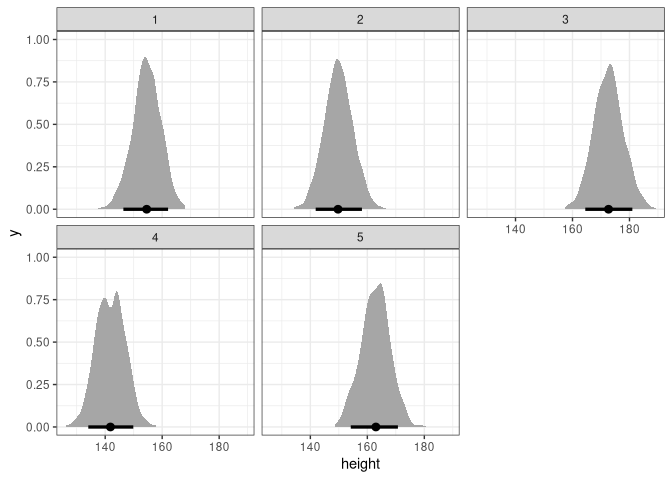
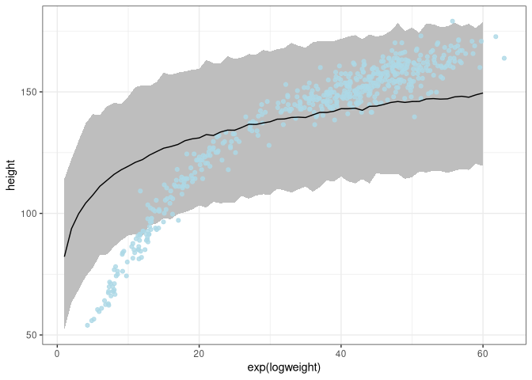
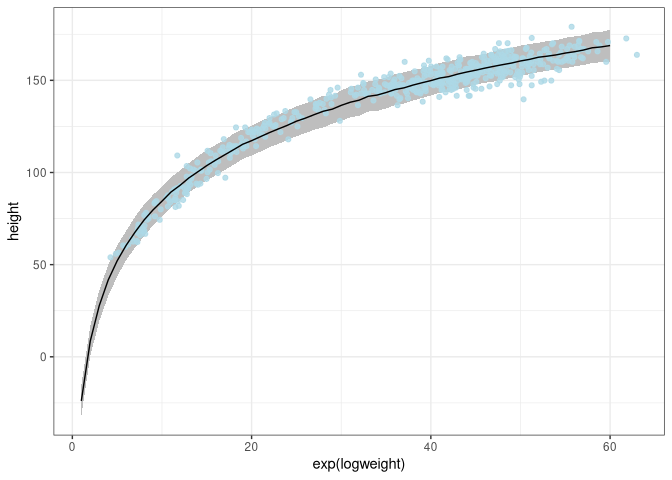

Week 2
================
Alec L. Robitaille
2021-08-24 \[updated: 2021-08-24\]

## Question 1

The weights listed below were recorded in the !Kung census, but heights
were not recorded for these individuals. Provide predicted heights and
89% compatibility intervals for each of these individuals. That is, fill
in the table below, using model-based predictions.

    Individual, weight, expected height, 89% interval
    1, 45,,,
    2, 40,,,
    3, 65,,,
    4, 31,,,
    5, 53,,,

Model:

*h*<sub>*i*</sub> ∼ Normal(*μ*<sub>*i*</sub>,*σ*)

*μ*<sub>*i*</sub> = *α* + *β*(*x*<sub>*i*</sub>−*x̄*)

*α* ∼ Normal(178,20)

*β* ∼ Log-Normal(0,1)

*σ* ∼ Uniform(0,50)

``` r
library(rethinking)
library(data.table)
library(ggplot2)
library(tidybayes)

theme_set(theme_bw())

data(Howell1)

d <- Howell1[Howell1$age >= 18,]

m <- quap(
    alist(
        height ~ dnorm(mu, sigma),
        mu <- a + b * (weight - mean(d$weight)),
        a ~ dnorm(178, 20),
        b ~ dnorm(0, 1),
        sigma ~ dunif(0, 50)
    ), 
    data = d
)

precis(m)
```

    ##              mean         sd        5.5%       94.5%
    ## a     154.6013678 0.27030752 154.1693642 155.0333714
    ## b       0.9034409 0.04189136   0.8364904   0.9703914
    ## sigma   5.0718782 0.19115449   4.7663764   5.3773800

Simulate:

``` r
# Set weights to simulate for
weights <- data.table(weight = c(45, 40, 65, 31, 54),
                                            id = as.character(seq(1, 5)))
simmed <- sim(m, list(weight = weights$weight), n = 1e3)

# Tidy
DT <- melt(as.data.table(simmed), measure.vars = paste0('V', 1:5),
                     value.name = 'height', variable.name = 'id')
DT[, id := gsub('V', '', id)]
DT[weights, weight := weight, on = 'id']

# Plot
ggplot(DT, aes(height)) +
    stat_halfeye(.width = .89) + 
    facet_wrap(~id)
```

<!-- -->

## Question 2

Model the relationship between height (cm) and the natural logarithm of
weight (log-kg): log(weight). Use the entire Howell1 data frame, all 544
rows, adults and non-adults. Use any model type from Chapter 4 that you
think useful: an ordinary linear regression, a polynomial or a spline.
Plot the posterior predictions against the raw data

``` r
library(rethinking)
library(data.table)
library(ggplot2)
library(tidybayes)

theme_set(theme_bw())

data(Howell1)
d <- Howell1
d$logweight <- log(d$weight)

m1 <- quap(
    alist(
        height ~ dnorm(mu, sigma),
        mu <- a + b * (logweight - mean(d$logweight)),
        a ~ dnorm(178, 20),
        b ~ dnorm(0, 1),
        sigma ~ dunif(0, 50)
    ), 
    data = d
)
sim_x <- log(1:60)
simmed <- sim(m1, list(logweight = sim_x))

# Tidy
DT <- melt(as.data.table(simmed), value.name = 'height', variable.name = 'x')
```

    ## Warning in melt.data.table(as.data.table(simmed), value.name = "height", :
    ## id.vars and measure.vars are internally guessed when both are 'NULL'. All
    ## non-numeric/integer/logical type columns are considered id.vars, which in this
    ## case are columns []. Consider providing at least one of 'id' or 'measure' vars
    ## in future.

``` r
DT[data.table(sim_x, x = paste0('V', 1:60)),
     logweight := sim_x,
     on = 'x']
DT[, meanheight := mean(height), by = logweight]
DT[, low := PI(height)[1], by = logweight]
DT[, high := PI(height)[2], by = logweight]

# Plot
ggplot(DT) + 
    geom_ribbon(aes(x = exp(logweight), ymin = low, ymax = high), fill = 'grey') + 
    geom_point(aes(exp(logweight), height), data = d, color = 'lightblue', alpha = 0.8) + 
    geom_line(aes(exp(logweight), meanheight))
```

<!-- -->

Using the dlnorm, prior of a Log normal distribution on beta

``` r
m2 <- quap(
    alist(
        height ~ dnorm(mu, sigma),
        mu <- a + b * (logweight - mean(d$logweight)),
        a ~ dnorm(178, 20),
        b ~ dlnorm(0, 1),
        sigma ~ dunif(0, 50)
    ), 
    data = d
)
sim_x <- log(1:60)
simmed <- sim(m2, list(logweight = sim_x))

# Tidy
DT <- melt(as.data.table(simmed), value.name = 'height', variable.name = 'x')
```

    ## Warning in melt.data.table(as.data.table(simmed), value.name = "height", :
    ## id.vars and measure.vars are internally guessed when both are 'NULL'. All
    ## non-numeric/integer/logical type columns are considered id.vars, which in this
    ## case are columns []. Consider providing at least one of 'id' or 'measure' vars
    ## in future.

``` r
DT[data.table(sim_x, x = paste0('V', 1:60)),
     logweight := sim_x,
     on = 'x']
DT[, meanheight := mean(height), by = logweight]
DT[, low := PI(height)[1], by = logweight]
DT[, high := PI(height)[2], by = logweight]

# Plot
ggplot(DT) + 
    geom_ribbon(aes(x = exp(logweight), ymin = low, ymax = high), fill = 'grey') + 
    geom_point(aes(exp(logweight), height), data = d, color = 'lightblue', alpha = 0.8) + 
    geom_line(aes(exp(logweight), meanheight))
```

<!-- -->
