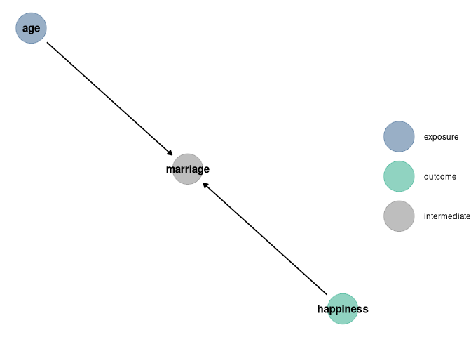

Alec L. Robitaille

# Homework: Week 4

2021-08-30 \[updated: 2021-09-02\]

### Setup

``` r
# Packages
library(ggdag)
```

    ## 
    ## Attaching package: 'ggdag'

    ## The following object is masked from 'package:stats':
    ## 
    ##     filter

``` r
library(dagitty)
library(data.table)
library(ggplot2)
library(tidybayes)

# Functions
dag_plot <- function(dag) {
    stat <- node_status(dag, FALSE)
    stat$data$status[is.na(stat$data$status)] <- 'intermediate'
    ggplot(stat, aes(x = x, y = y, xend = xend, yend = yend)) +
      geom_dag_point(aes(color = status), alpha = 0.5, size = 15) +
      geom_dag_edges() +
        labs(color = '') + 
      geom_dag_text(color = 'black') +
        scale_color_manual(values = list('exposure' = '#35608DFF',
                                                                         'outcome' = '#22A884FF',
                                                                         'intermediate' = 'grey50')) + 
      theme_void()
}
```

## Question 1

> Consider three fictional Polynesian islands. On each there is a Royal
> Ornithologist charged by the king with surveying the birb population.
> They have each found the following proportions of 5 important birb
> species:

``` r
# Data
birds <- matrix(
    c(0.2, 0.2, 0.2, 0.2, 0.2,
        0.8, 0.1, 0.05, 0.025, 0.025,
        0.05, 0.15, 0.7, 0.05, 0.05),
    nrow = 3, ncol = 5, byrow = TRUE
)
dimnames(birds) <- list(as.character(1:3), LETTERS[1:5])
birds
```

    ##      A    B    C     D     E
    ## 1 0.20 0.20 0.20 0.200 0.200
    ## 2 0.80 0.10 0.05 0.025 0.025
    ## 3 0.05 0.15 0.70 0.050 0.050

> First, compute the entropy of each island’s birb distribution.
> Interpret these entropy values

``` r
DT <- melt(data.table(birds, keep.rownames = 'island'), id.vars = 'island',
                     variable.name = 'id', value.name = 'proportion')

# Entropy
entropy <- function(p) -sum(p * log(p))
DT[, .(entropy = entropy(proportion)), by = island]
```

    ##    island entropy
    ##    <char>   <num>
    ## 1:      1    1.61
    ## 2:      2    0.74
    ## 3:      3    0.98

The information entropy describes the uncertainty in a distribution of
probabilities given the average log-probability of an event (from
Statistical Rethinking 7.2). Island 1 has the highest entropy, with the
flat probability of 0.2 across 5 bird species. Island 2 has the lowest
entropy, including species A with the highest overall proportion 0.8.

> Second, use each island’s birb distribution to predict the other two.
> This means to compute the K-L Divergence of each island from the
> others, treating each island as if it were a statistical model of the
> other islands. You should end up with 6 different K-L Divergence
> values. Which island predicts the others best? Why?

``` r
divergence <- function(p, q) sum(p * (log(p) - log(q)))
z <- CJ(p = DT$island, q = DT$island, unique = TRUE)[, row_id := .I]
z[, div := divergence(DT[island == p, proportion], 
                                            DT[island == q, proportion]),
    by = row_id]

z[p != q]
```

    ##         p      q row_id   div
    ##    <char> <char>  <int> <num>
    ## 1:      1      2      2  0.97
    ## 2:      1      3      3  0.64
    ## 3:      2      1      4  0.87
    ## 4:      2      3      6  2.01
    ## 5:      3      1      7  0.63
    ## 6:      3      2      8  1.84

`divergence(p, q)` = “Average difference in log probability between the
target (p) and the model (q)”.

Model 1 predicts target 3 best (lowest divergence at 0.63) and target 2
best (lowest divergence at 0.87) because it has the highest entropy.
Model 3 predicts target 1 best (lowest divergence at 0.64) because it
has higher entropy than model 2.

## Question 2

> Recall the marriage, age, and happiness collider bias example from
> Chapter 6. Run models m6.9 and m6.10 again.

### DAG

``` r
dag <- dagify(
    marriage ~ happiness,
    marriage ~ age,
    exposure = 'age',
    outcome = 'happiness'
)

dag_plot(dag)
```

<!-- -->

### Data

``` r
library(rethinking)
d <- sim_happiness(seed = 1977, N_years = 1e3)

d2 <- d[d$age > 17,]
d2$A <- (d2$age - 18) / (65 - 18)
d2$mid <- d2$married + 1

precis(d2)
```

    ##                          mean    sd   5.5% 94.5%  histogram
    ## age       41.5000000000000000 13.86 20.000 63.00 ▃▇▇▇▇▇▇▇▇▇
    ## married    0.4072916666666667  0.49  0.000  1.00 ▇▁▁▁▁▁▁▁▁▅
    ## happiness -0.0000000000000001  1.21 -1.789  1.79   ▇▅▇▅▅▇▅▇
    ## A          0.5000000000000000  0.29  0.043  0.96 ▇▇▇▅▇▇▅▇▇▇
    ## mid        1.4072916666666666  0.49  1.000  2.00 ▇▁▁▁▁▁▁▁▁▅

### Models

``` r
m6.9 <- quap(
    alist(
        happiness ~ dnorm(mu, sigma),
        mu <- a[mid] + bA * A,
        a[mid] ~ dnorm(0, 1),
        bA ~ dnorm(0, 2),
        sigma ~ dexp(1)
    ), data = d2
)

precis(m6.9, depth = 2)
```

    ##        mean    sd  5.5% 94.5%
    ## a[1]  -0.24 0.063 -0.34 -0.13
    ## a[2]   1.26 0.085  1.12  1.39
    ## bA    -0.75 0.113 -0.93 -0.57
    ## sigma  0.99 0.023  0.95  1.03

``` r
m6.10 <- quap(
    alist(
        happiness ~ dnorm(mu, sigma),
        mu <- a + bA * A,
        a ~ dnorm(0, 1),
        bA ~ dnorm(0, 2),
        sigma ~ dexp(1)
    ), data = d2
)

precis(m6.10, depth = 2)
```

    ##              mean    sd  5.5% 94.5%
    ## a      0.00000016 0.077 -0.12  0.12
    ## bA    -0.00000027 0.132 -0.21  0.21
    ## sigma  1.21318761 0.028  1.17  1.26

### Interpretation

> Compare these two models using WAIC (or LOO, they will produce
> identical results). Which model is expected to make better
> predictions? Which model provides the correct causal inference about
> the influence of age on happiness? Can you explain why the answers to
> these two questions disagree?

``` r
compare(m6.9, m6.10)
```

    ##       WAIC SE dWAIC dSE pWAIC
    ## m6.9  2714 38     0  NA   3.7
    ## m6.10 3102 28   388  35   2.3
    ##                                                                                         weight
    ## m6.9  1.00000000000000000000000000000000000000000000000000000000000000000000000000000000000000
    ## m6.10 0.00000000000000000000000000000000000000000000000000000000000000000000000000000000000057

Model 6.9 has a lower WAIC score,
