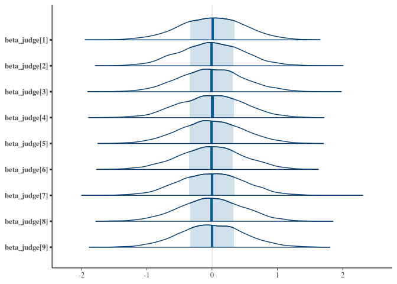
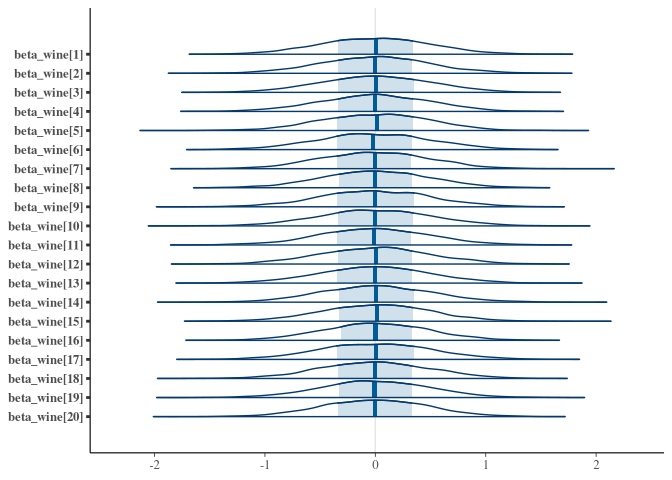
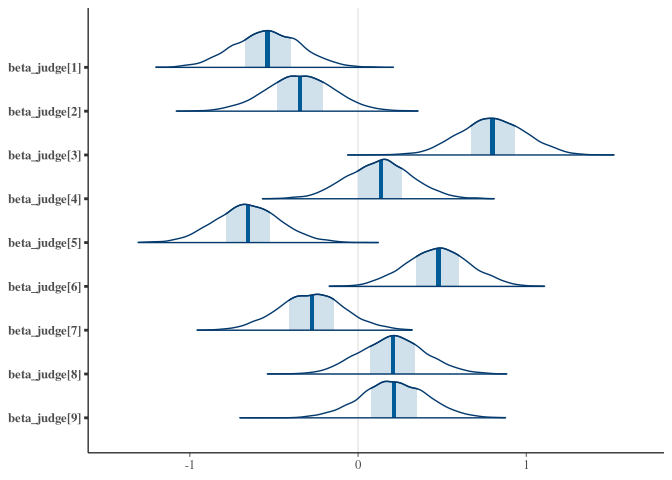
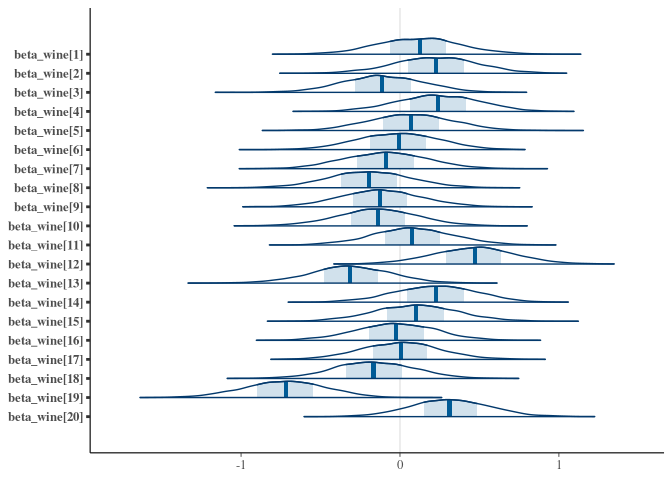

Alec L. Robitaille

# Homework: Week 5

2021-09-03 \[updated: 2021-09-06\]

### Setup

``` r
# Packages
library(ggdag)
```

    ## 
    ## Attaching package: 'ggdag'

    ## The following object is masked from 'package:stats':
    ## 
    ##     filter

``` r
library(dagitty)
library(data.table)
library(ggplot2)
library(tidybayes)

# Functions
dag_plot <- function(dag) {
    stat <- node_status(dag, FALSE)
    stat$data$status[is.na(stat$data$status)] <- 'intermediate'
    ggplot(stat, aes(x = x, y = y, xend = xend, yend = yend)) +
      geom_dag_point(aes(color = status), alpha = 0.5, size = 15) +
      geom_dag_edges() +
        labs(color = '') + 
      geom_dag_text(color = 'black') +
        scale_color_manual(values = list('exposure' = '#35608DFF',
                                                                         'outcome' = '#22A884FF',
                                                                         'intermediate' = 'grey50')) + 
      theme_void()
}

cmd_draws <- function(model) {
    as_draws_df(model$draws())
}
```

## Question 1

> Consider the `data(Wines2012)` data table. These data are expert
> ratings of 20 different French and American wines by 9 different
> French and American judges.

### Data

> Your goal is to model score, the subjective rating assigned by each
> judge to each wine. I recommend standardizing it. In this first
> problem, consider only variation among judges and wines. Construct
> index variables of judge and wine and then use these index variables
> to construct a linear regression model.

``` r
library(rethinking)
library(cmdstanr)
```

    ## This is cmdstanr version 0.4.0.9000

    ## - Online documentation and vignettes at mc-stan.org/cmdstanr

    ## - CmdStan path set to: /home/alecr/.cmdstan/cmdstan-2.27.0

    ## - Use set_cmdstan_path() to change the path

``` r
library(data.table)
library(posterior)
```

    ## This is posterior version 1.0.1

    ## 
    ## Attaching package: 'posterior'

    ## The following objects are masked from 'package:rstan':
    ## 
    ##     ess_bulk, ess_tail

    ## The following objects are masked from 'package:stats':
    ## 
    ##     mad, sd, var

``` r
library(bayesplot)
```

    ## This is bayesplot version 1.8.1

    ## - Online documentation and vignettes at mc-stan.org/bayesplot

    ## - bayesplot theme set to bayesplot::theme_default()

    ##    * Does _not_ affect other ggplot2 plots

    ##    * See ?bayesplot_theme_set for details on theme setting

    ## 
    ## Attaching package: 'bayesplot'

    ## The following object is masked from 'package:posterior':
    ## 
    ##     rhat

``` r
data("Wines2012")

DT <- data.table(Wines2012)

DT[, scale_score := scale(score)]
DT[, index_judge := .GRP, judge]
DT[, index_wine := .GRP, wine]

n_index_judge <- DT[, uniqueN(index_judge)]
n_index_wine <- DT[, uniqueN(index_wine)]
n_rows <- DT[, .N]
```

### Prior predictive simulation

``` r
q1_stan <- 'q1_prior.stan'
writeLines(readLines(q1_stan))
```

    ## data {
    ##   int<lower=0> N;
    ##   int<lower=0> N_judges;
    ##   int<lower=0> N_wines;
    ## }
    ## parameters{
    ##   real alpha;
    ##   vector[N_judges] beta_judge;
    ##   vector[N_wines] beta_wine;
    ##   real<lower=0> sigma;
    ## }
    ## model{
    ##   sigma ~ exponential(1);
    ##   beta_wine ~ normal(0, 0.5);
    ##   beta_judge~normal(0, 0.5);
    ##   alpha~normal(0, 0.2);
    ## }

``` r
q1_prior <- cmdstan_model(q1_stan)

q1_prior_sample <- q1_prior$sample(
    data = list(N = n_rows,
                            N_judges = n_index_judge,
                            N_wines = n_index_wine)
)
```

    ## Running MCMC with 4 sequential chains...
    ## 
    ## Chain 1 Iteration:    1 / 2000 [  0%]  (Warmup) 
    ## Chain 1 Iteration:  100 / 2000 [  5%]  (Warmup) 
    ## Chain 1 Iteration:  200 / 2000 [ 10%]  (Warmup) 
    ## Chain 1 Iteration:  300 / 2000 [ 15%]  (Warmup) 
    ## Chain 1 Iteration:  400 / 2000 [ 20%]  (Warmup) 
    ## Chain 1 Iteration:  500 / 2000 [ 25%]  (Warmup) 
    ## Chain 1 Iteration:  600 / 2000 [ 30%]  (Warmup) 
    ## Chain 1 Iteration:  700 / 2000 [ 35%]  (Warmup) 
    ## Chain 1 Iteration:  800 / 2000 [ 40%]  (Warmup) 
    ## Chain 1 Iteration:  900 / 2000 [ 45%]  (Warmup) 
    ## Chain 1 Iteration: 1000 / 2000 [ 50%]  (Warmup) 
    ## Chain 1 Iteration: 1001 / 2000 [ 50%]  (Sampling) 
    ## Chain 1 Iteration: 1100 / 2000 [ 55%]  (Sampling) 
    ## Chain 1 Iteration: 1200 / 2000 [ 60%]  (Sampling) 
    ## Chain 1 Iteration: 1300 / 2000 [ 65%]  (Sampling) 
    ## Chain 1 Iteration: 1400 / 2000 [ 70%]  (Sampling) 
    ## Chain 1 Iteration: 1500 / 2000 [ 75%]  (Sampling) 
    ## Chain 1 Iteration: 1600 / 2000 [ 80%]  (Sampling) 
    ## Chain 1 Iteration: 1700 / 2000 [ 85%]  (Sampling) 
    ## Chain 1 Iteration: 1800 / 2000 [ 90%]  (Sampling) 
    ## Chain 1 Iteration: 1900 / 2000 [ 95%]  (Sampling) 
    ## Chain 1 Iteration: 2000 / 2000 [100%]  (Sampling) 
    ## Chain 1 finished in 0.1 seconds.
    ## Chain 2 Iteration:    1 / 2000 [  0%]  (Warmup) 
    ## Chain 2 Iteration:  100 / 2000 [  5%]  (Warmup) 
    ## Chain 2 Iteration:  200 / 2000 [ 10%]  (Warmup) 
    ## Chain 2 Iteration:  300 / 2000 [ 15%]  (Warmup) 
    ## Chain 2 Iteration:  400 / 2000 [ 20%]  (Warmup) 
    ## Chain 2 Iteration:  500 / 2000 [ 25%]  (Warmup) 
    ## Chain 2 Iteration:  600 / 2000 [ 30%]  (Warmup) 
    ## Chain 2 Iteration:  700 / 2000 [ 35%]  (Warmup) 
    ## Chain 2 Iteration:  800 / 2000 [ 40%]  (Warmup) 
    ## Chain 2 Iteration:  900 / 2000 [ 45%]  (Warmup) 
    ## Chain 2 Iteration: 1000 / 2000 [ 50%]  (Warmup) 
    ## Chain 2 Iteration: 1001 / 2000 [ 50%]  (Sampling) 
    ## Chain 2 Iteration: 1100 / 2000 [ 55%]  (Sampling) 
    ## Chain 2 Iteration: 1200 / 2000 [ 60%]  (Sampling) 
    ## Chain 2 Iteration: 1300 / 2000 [ 65%]  (Sampling) 
    ## Chain 2 Iteration: 1400 / 2000 [ 70%]  (Sampling) 
    ## Chain 2 Iteration: 1500 / 2000 [ 75%]  (Sampling) 
    ## Chain 2 Iteration: 1600 / 2000 [ 80%]  (Sampling) 
    ## Chain 2 Iteration: 1700 / 2000 [ 85%]  (Sampling) 
    ## Chain 2 Iteration: 1800 / 2000 [ 90%]  (Sampling) 
    ## Chain 2 Iteration: 1900 / 2000 [ 95%]  (Sampling) 
    ## Chain 2 Iteration: 2000 / 2000 [100%]  (Sampling) 
    ## Chain 2 finished in 0.1 seconds.
    ## Chain 3 Iteration:    1 / 2000 [  0%]  (Warmup) 
    ## Chain 3 Iteration:  100 / 2000 [  5%]  (Warmup) 
    ## Chain 3 Iteration:  200 / 2000 [ 10%]  (Warmup) 
    ## Chain 3 Iteration:  300 / 2000 [ 15%]  (Warmup) 
    ## Chain 3 Iteration:  400 / 2000 [ 20%]  (Warmup) 
    ## Chain 3 Iteration:  500 / 2000 [ 25%]  (Warmup) 
    ## Chain 3 Iteration:  600 / 2000 [ 30%]  (Warmup) 
    ## Chain 3 Iteration:  700 / 2000 [ 35%]  (Warmup) 
    ## Chain 3 Iteration:  800 / 2000 [ 40%]  (Warmup) 
    ## Chain 3 Iteration:  900 / 2000 [ 45%]  (Warmup) 
    ## Chain 3 Iteration: 1000 / 2000 [ 50%]  (Warmup) 
    ## Chain 3 Iteration: 1001 / 2000 [ 50%]  (Sampling) 
    ## Chain 3 Iteration: 1100 / 2000 [ 55%]  (Sampling) 
    ## Chain 3 Iteration: 1200 / 2000 [ 60%]  (Sampling) 
    ## Chain 3 Iteration: 1300 / 2000 [ 65%]  (Sampling) 
    ## Chain 3 Iteration: 1400 / 2000 [ 70%]  (Sampling) 
    ## Chain 3 Iteration: 1500 / 2000 [ 75%]  (Sampling) 
    ## Chain 3 Iteration: 1600 / 2000 [ 80%]  (Sampling) 
    ## Chain 3 Iteration: 1700 / 2000 [ 85%]  (Sampling) 
    ## Chain 3 Iteration: 1800 / 2000 [ 90%]  (Sampling) 
    ## Chain 3 Iteration: 1900 / 2000 [ 95%]  (Sampling) 
    ## Chain 3 Iteration: 2000 / 2000 [100%]  (Sampling) 
    ## Chain 3 finished in 0.1 seconds.
    ## Chain 4 Iteration:    1 / 2000 [  0%]  (Warmup) 
    ## Chain 4 Iteration:  100 / 2000 [  5%]  (Warmup) 
    ## Chain 4 Iteration:  200 / 2000 [ 10%]  (Warmup) 
    ## Chain 4 Iteration:  300 / 2000 [ 15%]  (Warmup) 
    ## Chain 4 Iteration:  400 / 2000 [ 20%]  (Warmup) 
    ## Chain 4 Iteration:  500 / 2000 [ 25%]  (Warmup) 
    ## Chain 4 Iteration:  600 / 2000 [ 30%]  (Warmup) 
    ## Chain 4 Iteration:  700 / 2000 [ 35%]  (Warmup) 
    ## Chain 4 Iteration:  800 / 2000 [ 40%]  (Warmup) 
    ## Chain 4 Iteration:  900 / 2000 [ 45%]  (Warmup) 
    ## Chain 4 Iteration: 1000 / 2000 [ 50%]  (Warmup) 
    ## Chain 4 Iteration: 1001 / 2000 [ 50%]  (Sampling) 
    ## Chain 4 Iteration: 1100 / 2000 [ 55%]  (Sampling) 
    ## Chain 4 Iteration: 1200 / 2000 [ 60%]  (Sampling) 
    ## Chain 4 Iteration: 1300 / 2000 [ 65%]  (Sampling) 
    ## Chain 4 Iteration: 1400 / 2000 [ 70%]  (Sampling) 
    ## Chain 4 Iteration: 1500 / 2000 [ 75%]  (Sampling) 
    ## Chain 4 Iteration: 1600 / 2000 [ 80%]  (Sampling) 
    ## Chain 4 Iteration: 1700 / 2000 [ 85%]  (Sampling) 
    ## Chain 4 Iteration: 1800 / 2000 [ 90%]  (Sampling) 
    ## Chain 4 Iteration: 1900 / 2000 [ 95%]  (Sampling) 
    ## Chain 4 Iteration: 2000 / 2000 [100%]  (Sampling) 
    ## Chain 4 finished in 0.1 seconds.
    ## 
    ## All 4 chains finished successfully.
    ## Mean chain execution time: 0.1 seconds.
    ## Total execution time: 0.6 seconds.

``` r
q1_prior_draws <- cmd_draws(q1_prior_sample)

mcmc_areas(q1_prior_draws, regex_pars = 'judge')
```

<!-- -->

``` r
mcmc_areas(q1_prior_draws, regex_pars = 'wine')
```

<!-- -->

> Justify your priors. You should end up with 9 judge parameters and 20
> wine parameters.

Given the parameters are scaled, the prior predictive plots show scaled
wine scores mostly between -2 and 2. Since we do not have any prior
knowledge about how this relationship (positive/negative slopes), we are
satisfied with this relatively conservative prior.

### Model

> Use ulam instead of quap to build this model, and be sure to check the
> chains for convergence. If you’d rather build the model directly in
> Stan or PyMC3, go ahead. I just want you to use Hamiltonian Monte
> Carlo instead of quadratic approximation.

``` r
q1_stan <- 'q1.stan'
writeLines(readLines(q1_stan))
```

    ## data {
    ##   int<lower=0> N;
    ##   int<lower=0> N_judges;
    ##   int<lower=0> N_wines;
    ##   int index_judge[N];
    ##   int index_wine[N];
    ##   vector[N] scale_score;
    ## }
    ## parameters{
    ##   real alpha;
    ##   vector[N_judges] beta_judge;
    ##   vector[N_wines] beta_wine;
    ##   real<lower=0> sigma;
    ## }
    ## model{
    ##   alpha ~ normal(0, 0.2);
    ##   beta_wine ~ normal(0, 0.5);
    ##   beta_judge ~ normal(0, 0.5);
    ##   sigma ~ exponential(1);
    ## 
    ##   vector[N] mu;
    ##   mu = beta_wine[index_wine] + beta_judge[index_judge];
    ##   scale_score ~ normal(mu, sigma);
    ## }

``` r
q1_model <- cmdstan_model(q1_stan)

q1_sample <- q1_model$sample(
    data = list(N = n_rows,
                            N_judges = n_index_judge,
                            N_wines = n_index_wine,
                            scale_score = DT[, as.numeric(scale_score)],
                            index_judge = DT[, as.numeric(index_judge)],
                            index_wine = DT[, as.numeric(index_wine)]
                            )
)
```

    ## Running MCMC with 4 sequential chains...
    ## 
    ## Chain 1 Iteration:    1 / 2000 [  0%]  (Warmup) 
    ## Chain 1 Iteration:  100 / 2000 [  5%]  (Warmup) 
    ## Chain 1 Iteration:  200 / 2000 [ 10%]  (Warmup) 
    ## Chain 1 Iteration:  300 / 2000 [ 15%]  (Warmup) 
    ## Chain 1 Iteration:  400 / 2000 [ 20%]  (Warmup) 
    ## Chain 1 Iteration:  500 / 2000 [ 25%]  (Warmup) 
    ## Chain 1 Iteration:  600 / 2000 [ 30%]  (Warmup) 
    ## Chain 1 Iteration:  700 / 2000 [ 35%]  (Warmup) 
    ## Chain 1 Iteration:  800 / 2000 [ 40%]  (Warmup) 
    ## Chain 1 Iteration:  900 / 2000 [ 45%]  (Warmup) 
    ## Chain 1 Iteration: 1000 / 2000 [ 50%]  (Warmup) 
    ## Chain 1 Iteration: 1001 / 2000 [ 50%]  (Sampling) 
    ## Chain 1 Iteration: 1100 / 2000 [ 55%]  (Sampling) 
    ## Chain 1 Iteration: 1200 / 2000 [ 60%]  (Sampling) 
    ## Chain 1 Iteration: 1300 / 2000 [ 65%]  (Sampling) 
    ## Chain 1 Iteration: 1400 / 2000 [ 70%]  (Sampling) 
    ## Chain 1 Iteration: 1500 / 2000 [ 75%]  (Sampling) 
    ## Chain 1 Iteration: 1600 / 2000 [ 80%]  (Sampling) 
    ## Chain 1 Iteration: 1700 / 2000 [ 85%]  (Sampling) 
    ## Chain 1 Iteration: 1800 / 2000 [ 90%]  (Sampling) 
    ## Chain 1 Iteration: 1900 / 2000 [ 95%]  (Sampling) 
    ## Chain 1 Iteration: 2000 / 2000 [100%]  (Sampling) 
    ## Chain 1 finished in 0.1 seconds.
    ## Chain 2 Iteration:    1 / 2000 [  0%]  (Warmup) 
    ## Chain 2 Iteration:  100 / 2000 [  5%]  (Warmup) 
    ## Chain 2 Iteration:  200 / 2000 [ 10%]  (Warmup) 
    ## Chain 2 Iteration:  300 / 2000 [ 15%]  (Warmup) 
    ## Chain 2 Iteration:  400 / 2000 [ 20%]  (Warmup) 
    ## Chain 2 Iteration:  500 / 2000 [ 25%]  (Warmup) 
    ## Chain 2 Iteration:  600 / 2000 [ 30%]  (Warmup) 
    ## Chain 2 Iteration:  700 / 2000 [ 35%]  (Warmup) 
    ## Chain 2 Iteration:  800 / 2000 [ 40%]  (Warmup) 
    ## Chain 2 Iteration:  900 / 2000 [ 45%]  (Warmup) 
    ## Chain 2 Iteration: 1000 / 2000 [ 50%]  (Warmup) 
    ## Chain 2 Iteration: 1001 / 2000 [ 50%]  (Sampling) 
    ## Chain 2 Iteration: 1100 / 2000 [ 55%]  (Sampling) 
    ## Chain 2 Iteration: 1200 / 2000 [ 60%]  (Sampling) 
    ## Chain 2 Iteration: 1300 / 2000 [ 65%]  (Sampling) 
    ## Chain 2 Iteration: 1400 / 2000 [ 70%]  (Sampling) 
    ## Chain 2 Iteration: 1500 / 2000 [ 75%]  (Sampling) 
    ## Chain 2 Iteration: 1600 / 2000 [ 80%]  (Sampling) 
    ## Chain 2 Iteration: 1700 / 2000 [ 85%]  (Sampling) 
    ## Chain 2 Iteration: 1800 / 2000 [ 90%]  (Sampling) 
    ## Chain 2 Iteration: 1900 / 2000 [ 95%]  (Sampling) 
    ## Chain 2 Iteration: 2000 / 2000 [100%]  (Sampling) 
    ## Chain 2 finished in 0.1 seconds.
    ## Chain 3 Iteration:    1 / 2000 [  0%]  (Warmup) 
    ## Chain 3 Iteration:  100 / 2000 [  5%]  (Warmup) 
    ## Chain 3 Iteration:  200 / 2000 [ 10%]  (Warmup) 
    ## Chain 3 Iteration:  300 / 2000 [ 15%]  (Warmup) 
    ## Chain 3 Iteration:  400 / 2000 [ 20%]  (Warmup) 
    ## Chain 3 Iteration:  500 / 2000 [ 25%]  (Warmup) 
    ## Chain 3 Iteration:  600 / 2000 [ 30%]  (Warmup) 
    ## Chain 3 Iteration:  700 / 2000 [ 35%]  (Warmup) 
    ## Chain 3 Iteration:  800 / 2000 [ 40%]  (Warmup) 
    ## Chain 3 Iteration:  900 / 2000 [ 45%]  (Warmup) 
    ## Chain 3 Iteration: 1000 / 2000 [ 50%]  (Warmup) 
    ## Chain 3 Iteration: 1001 / 2000 [ 50%]  (Sampling) 
    ## Chain 3 Iteration: 1100 / 2000 [ 55%]  (Sampling) 
    ## Chain 3 Iteration: 1200 / 2000 [ 60%]  (Sampling) 
    ## Chain 3 Iteration: 1300 / 2000 [ 65%]  (Sampling) 
    ## Chain 3 Iteration: 1400 / 2000 [ 70%]  (Sampling) 
    ## Chain 3 Iteration: 1500 / 2000 [ 75%]  (Sampling) 
    ## Chain 3 Iteration: 1600 / 2000 [ 80%]  (Sampling) 
    ## Chain 3 Iteration: 1700 / 2000 [ 85%]  (Sampling) 
    ## Chain 3 Iteration: 1800 / 2000 [ 90%]  (Sampling) 
    ## Chain 3 Iteration: 1900 / 2000 [ 95%]  (Sampling) 
    ## Chain 3 Iteration: 2000 / 2000 [100%]  (Sampling) 
    ## Chain 3 finished in 0.1 seconds.
    ## Chain 4 Iteration:    1 / 2000 [  0%]  (Warmup) 
    ## Chain 4 Iteration:  100 / 2000 [  5%]  (Warmup) 
    ## Chain 4 Iteration:  200 / 2000 [ 10%]  (Warmup) 
    ## Chain 4 Iteration:  300 / 2000 [ 15%]  (Warmup) 
    ## Chain 4 Iteration:  400 / 2000 [ 20%]  (Warmup) 
    ## Chain 4 Iteration:  500 / 2000 [ 25%]  (Warmup) 
    ## Chain 4 Iteration:  600 / 2000 [ 30%]  (Warmup) 
    ## Chain 4 Iteration:  700 / 2000 [ 35%]  (Warmup) 
    ## Chain 4 Iteration:  800 / 2000 [ 40%]  (Warmup) 
    ## Chain 4 Iteration:  900 / 2000 [ 45%]  (Warmup) 
    ## Chain 4 Iteration: 1000 / 2000 [ 50%]  (Warmup) 
    ## Chain 4 Iteration: 1001 / 2000 [ 50%]  (Sampling) 
    ## Chain 4 Iteration: 1100 / 2000 [ 55%]  (Sampling) 
    ## Chain 4 Iteration: 1200 / 2000 [ 60%]  (Sampling) 
    ## Chain 4 Iteration: 1300 / 2000 [ 65%]  (Sampling) 
    ## Chain 4 Iteration: 1400 / 2000 [ 70%]  (Sampling) 
    ## Chain 4 Iteration: 1500 / 2000 [ 75%]  (Sampling) 
    ## Chain 4 Iteration: 1600 / 2000 [ 80%]  (Sampling) 
    ## Chain 4 Iteration: 1700 / 2000 [ 85%]  (Sampling) 
    ## Chain 4 Iteration: 1800 / 2000 [ 90%]  (Sampling) 
    ## Chain 4 Iteration: 1900 / 2000 [ 95%]  (Sampling) 
    ## Chain 4 Iteration: 2000 / 2000 [100%]  (Sampling) 
    ## Chain 4 finished in 0.1 seconds.
    ## 
    ## All 4 chains finished successfully.
    ## Mean chain execution time: 0.1 seconds.
    ## Total execution time: 0.9 seconds.

``` r
q1_draws <- cmd_draws(q1_sample)
setDT(q1_draws)
```

> How do you interpret the variation among individual judges and
> individual wines? Do you notice any patterns, just by plotting the
> differences? Which judges gave the highest/lowest ratings? Which wines
> were rated worst/ best on average?

``` r
# Judges
precis(q1_draws, depth = 2)[3:11,]
```

    ##                mean   sd  5.5%  94.5%       histogram
    ## beta_judge[1] -0.54 0.20 -0.86 -0.222       ▁▁▂▅▇▃▁▁▁
    ## beta_judge[2] -0.34 0.20 -0.67 -0.028        ▁▁▂▅▇▃▁▁
    ## beta_judge[3]  0.80 0.20  0.48  1.115       ▁▁▁▃▇▇▂▁▁
    ## beta_judge[4]  0.13 0.19 -0.18  0.440 ▁▁▁▁▂▃▇▇▅▃▂▁▁▁▁
    ## beta_judge[5] -0.65 0.19 -0.96 -0.341        ▁▁▃▇▅▂▁▁
    ## beta_judge[6]  0.48 0.19  0.17  0.787  ▁▁▁▂▃▇▇▇▅▂▁▁▁▁
    ## beta_judge[7] -0.28 0.20 -0.60  0.045  ▁▁▁▁▂▅▇▇▇▃▂▁▁▁
    ## beta_judge[8]  0.21 0.20 -0.11  0.522        ▁▁▂▇▇▂▁▁
    ## beta_judge[9]  0.21 0.20 -0.10  0.533       ▁▁▁▂▇▇▃▁▁

``` r
melt(q1_draws, measure.vars = patterns('beta_judge'))[, .(mean_score = mean(value)), variable][order(-mean_score)]
```

    ##         variable mean_score
    ##           <fctr>      <num>
    ## 1: beta_judge[3]       0.80
    ## 2: beta_judge[6]       0.48
    ## 3: beta_judge[9]       0.21
    ## 4: beta_judge[8]       0.21
    ## 5: beta_judge[4]       0.13
    ## 6: beta_judge[7]      -0.28
    ## 7: beta_judge[2]      -0.34
    ## 8: beta_judge[1]      -0.54
    ## 9: beta_judge[5]      -0.65

``` r
mcmc_areas(q1_draws, regex_pars = 'judge')
```

<!-- -->

``` r
precis(q1_draws, depth = 2)[12:31,]
```

    ##                  mean   sd   5.5%  94.5%   histogram
    ## beta_wine[1]   0.1188 0.27 -0.300  0.552 ▁▁▁▂▅▇▇▂▁▁▁
    ## beta_wine[2]   0.2247 0.26 -0.207  0.642  ▁▁▁▃▇▇▅▂▁▁
    ## beta_wine[3]  -0.1061 0.26 -0.520  0.303  ▁▁▁▂▅▇▅▂▁▁
    ## beta_wine[4]   0.2405 0.26 -0.180  0.650  ▁▁▁▃▇▇▅▂▁▁
    ## beta_wine[5]   0.0701 0.26 -0.342  0.486 ▁▁▁▃▇▇▅▂▁▁▁
    ## beta_wine[6]  -0.0112 0.26 -0.418  0.393  ▁▁▁▁▅▇▇▃▁▁
    ## beta_wine[7]  -0.0887 0.26 -0.498  0.327 ▁▁▁▂▅▇▇▂▁▁▁
    ## beta_wine[8]  -0.1935 0.26 -0.608  0.229 ▁▁▁▁▃▇▇▃▁▁▁
    ## beta_wine[9]  -0.1210 0.26 -0.529  0.300  ▁▁▂▅▇▅▂▁▁▁
    ## beta_wine[10] -0.1417 0.26 -0.566  0.268 ▁▁▁▂▇▇▅▂▁▁▁
    ## beta_wine[11]  0.0820 0.26 -0.332  0.497  ▁▁▁▂▅▇▅▂▁▁
    ## beta_wine[12]  0.4653 0.26  0.042  0.881  ▁▁▁▂▅▇▅▂▁▁
    ## beta_wine[13] -0.3148 0.26 -0.733  0.095 ▁▁▁▂▅▇▅▂▁▁▁
    ## beta_wine[14]  0.2237 0.26 -0.197  0.625  ▁▁▁▃▇▇▅▂▁▁
    ## beta_wine[15]  0.1007 0.26 -0.325  0.530 ▁▁▁▂▅▇▅▂▁▁▁
    ## beta_wine[16] -0.0265 0.25 -0.434  0.372  ▁▁▂▃▇▇▃▁▁▁
    ## beta_wine[17]  0.0059 0.25 -0.398  0.413  ▁▁▁▃▇▇▃▁▁▁
    ## beta_wine[18] -0.1634 0.26 -0.570  0.249  ▁▁▁▃▇▇▅▂▁▁
    ## beta_wine[19] -0.7244 0.26 -1.142 -0.319 ▁▁▁▂▇▇▅▂▁▁▁
    ## beta_wine[20]  0.3177 0.25 -0.080  0.716 ▁▁▁▂▅▇▅▂▁▁▁

``` r
melt(q1_draws, measure.vars = patterns('beta_wine'))[, .(mean_score = mean(value)), variable][order(-mean_score)]
```

    ##          variable mean_score
    ##            <fctr>      <num>
    ##  1: beta_wine[12]     0.4653
    ##  2: beta_wine[20]     0.3177
    ##  3:  beta_wine[4]     0.2405
    ##  4:  beta_wine[2]     0.2247
    ##  5: beta_wine[14]     0.2237
    ##  6:  beta_wine[1]     0.1188
    ##  7: beta_wine[15]     0.1007
    ##  8: beta_wine[11]     0.0820
    ##  9:  beta_wine[5]     0.0701
    ## 10: beta_wine[17]     0.0059
    ## 11:  beta_wine[6]    -0.0112
    ## 12: beta_wine[16]    -0.0265
    ## 13:  beta_wine[7]    -0.0887
    ## 14:  beta_wine[3]    -0.1061
    ## 15:  beta_wine[9]    -0.1210
    ## 16: beta_wine[10]    -0.1417
    ## 17: beta_wine[18]    -0.1634
    ## 18:  beta_wine[8]    -0.1935
    ## 19: beta_wine[13]    -0.3148
    ## 20: beta_wine[19]    -0.7244
    ##          variable mean_score

``` r
mcmc_areas(q1_draws, regex_pars = 'wine')
```

<!-- -->

Accounting for judges, most wines are scored with similar distributions.
Wine 19 however was particularly poorly scored. Judges, however, have
much more variable scoring with three individuals (judges 1, 2, 5)
entirely or almost entirely scoring lower than other judges. The worst
scoring judge was judge 5.

## Question 2
